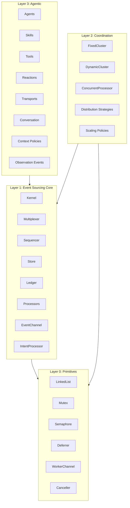
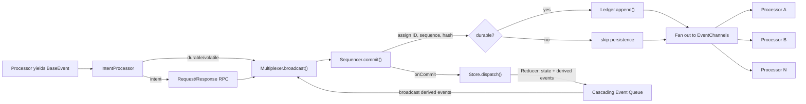

# Architecture

**Ductus** (Latin: *leadership*) is an event sourcing framework for building autonomous agentic workflows. It provides declarative primitives for processors, reactions, reducers, backpressure management, and agentic coordination — all built on async generators.

---

## System Purpose and Guiding Principles

### Core Thesis

Async generators are the programming model. The fundamental execution contract is:

```
AsyncIterable<CommittedEvent>  →  Processor  →  AsyncIterable<BaseEvent>
```

Everything — processors, reactions, clusters, concurrent handlers — resolves to this shape (`EventGenerator<TState>`). This was a deliberate design choice: async generators provide natural backpressure, natural cancellation, and familiar `async/await` control flow. Push-based alternatives like RxJS were explicitly rejected in favor of pull-based stream processing using standard language primitives.

### Guiding Principles

- **Everything is events.** All activity — domain logic, agentic invocations, tool calls, completions, failures — translates to events that flow through the multiplexer and are observable by any processor.
- **Store is pure, processors are not.** The store/reducer is a synchronous, deterministic, side-effect-free projection. All impurity (I/O, LLM calls, tool execution) belongs in processors.
- **Skills are pure contracts.** A skill defines input schema, output schema, assertion, and retry budget. No side effects, no transforms, no observations, no model, no transport.
- **Agents own runtime configuration.** The agent declares identity, capabilities, constraints, infrastructure defaults, and observation preferences. The flow can override infrastructure for deployment contexts.
- **Reactions stay simple.** Complex orchestration is expressed through events and multiple reactions (event sourcing principle) or through processors. Reactions are not extended with loops, branches, or parallel invocations.
- **Agent-to-agent communication is event-mediated only.** Direct agent invocation would bypass the ledger, the reducer, and user-defined orchestration logic. The pattern is: Agent A emits event, reaction triggers Agent B.
- **Framework owns tool loop, conversation, and output parsing.** The transport is a thin pipe: messages in, chunks out.
- **Zero third-party dependencies for core concurrency primitives.** Bringing primitives from third parties into a sensitive event sourcing framework is unacceptable risk. The framework owns its LinkedList, Mutex, Semaphore, and Deferrer.

---

## High-Level Structure



### Event Data Flow



---

## Key Modules

### Kernel — [`src/core/ductus-kernel.ts`](src/core/ductus-kernel.ts)

Orchestrates boot (hydrate store from ledger, mount processors), the cascading event loop, and shutdown (graceful drain or forced cancellation with timeout). [INFERRED] The kernel is a coordinator that wires subsystems together without owning any subsystem's logic.

The kernel maintains:
- A **cascading event queue** (LinkedList) for events produced by the reducer. A dedicated async loop drains this queue and broadcasts derived events back through the multiplexer.
- A **causation graph** (Map) for cycle detection. Before broadcasting a cascading event, the kernel walks the causation chain. If depth exceeds 100, it force-cancels — [INFERRED] preventing infinite recursive event loops from cascading reducers.
- **Promise-based wake-up resolvers** for the cascade loop when idle.

### Multiplexer — [`src/core/multiplexer/`](src/core/multiplexer/)

Fans out committed events to all subscriber EventChannels. Separated from the sequencer by single responsibility: the sequencer is the authority for ordering and integrity; the multiplexer is the authority for distribution.

Three strategies, each for a different operational profile:

| Strategy | Behavior | Use case |
|---|---|---|
| `BlockingMultiplexer` | Waits for all consumers to drain before returning from `broadcast()`. Zero buffering. | Deterministic ordering. Tests, debugging, pipelines where event N+1 must not be produced until N is fully processed. |
| `FailFirstMultiplexer` | Fire-and-forget with hard queue limit. Throws `BackpressureExceededError` if any consumer exceeds `maxQueueSize`. | Slow consumers are bugs, not features. CI pipelines, health monitoring, critical paths. |
| `ThrottleMultiplexer` | High/low watermark with optional stall timeout. Pauses producers when consumers fall behind, resumes when they catch up. | Production workloads with variable-latency consumers (LLM calls, network I/O) where transient slowness is normal. |

### Sequencer — [`src/core/default-event-sequencer.ts`](src/core/default-event-sequencer.ts)

Assigns identity to events: `eventId`, `sequenceNumber`, `prevHash`, `hash`, `timestamp`. Persists durable events to the ledger. Fires `onCommit` listeners.

**Hash chain:** Each durable event's hash includes the previous durable event's hash. This protects against loading a tampered ledger and guarantees ordering integrity. Volatile events get sequence numbers but skip the hash chain and ledger persistence.

**Hydration:** On restart, the sequencer reads the last persisted event to restore `lastDurableHash` and `lastSequenceNumber`. Volatile events' sequence numbers are reused since they aren't persisted — by design, no collision occurs.

### Store — [`src/core/ductus-store.ts`](src/core/ductus-store.ts)

Synchronous state derivation via reducer. The store is pure: deterministic, no I/O. The reducer follows the **Elm architecture** pattern — it returns `[newState, BaseEvent[]]`. State updates sometimes must be accompanied by derived events (e.g., "when counter reaches threshold, emit ThresholdReached"). This is not an ad-hoc extension; it is the Elm `update` function's `(Model, Cmd Msg)` return type.

The store supports optional snapshot save/load for fast recovery without full ledger replay.

### Event Channel — [`src/core/event-channel.ts`](src/core/event-channel.ts)

Per-subscriber async queue with drain signaling. [INFERRED] Decouples producer speed from consumer speed; the multiplexer strategy determines how that decoupling behaves.

Implements `EventSubscriber` with:
- `enqueue()` — push events into the LinkedList queue, wake up the stream consumer.
- `streamEvents()` — async generator that yields events from the queue, sleeping when empty.
- `waitForDrain()` — used by the BlockingMultiplexer to await consumer processing.
- `unsubscribe({ drain })` — graceful (drain remaining events) or immediate (return unconsumed events).
- `consume()` — marks the channel as actively consuming, enabling multiplexer awareness of consumer state.

### Intent Processor — [`src/core/intent-processor.ts`](src/core/intent-processor.ts)

Sits between each processor's output iterator and the multiplexer. Handles three volatility modes:

- **Durable/volatile events** — broadcast normally through the multiplexer.
- **Intent events** — intercepted for request/response coordination. `RequestIntent` broadcasts an event with a `chainId` and awaits a matching `ResponseIntent` on the sequencer's commit listener. This provides synchronous-feeling RPC over the async event flow. Intents are the shortest-lived events: processor to IntentProcessor only, never reaching subscribers or the store.

The IntentProcessor also feeds the committed event back to the processor via `iterator.next(committedEvent)`, enabling processors to receive the committed version of what they yielded.

### Agent Dispatcher — [`src/core/agent-dispatcher.ts`](src/core/agent-dispatcher.ts)

Coordinates agent invocation: lifecycle management, prompt composition, context policy enforcement, the invocation itself (transport call, tool loop, output parsing), and observation event collection. Currently being decomposed into focused components per RFC 0001 structural remediation.

The dispatcher delegates to:
- `AgentLifecycleManager` — manages per-agent state (conversation, token counts, turn counts, failure/hallucination tracking), enforces scope limits, triggers handoff/replacement.
- `AgentPromptComposer` — assembles the system message from agent persona, rules, rulesets, and system prompt templates.
- `invokeAgent()` — executes the full invocation sequence: transport call, streaming chunk processing, tool loop, output parsing, skill assertion with retry.
- `enforceContextPolicy()` — applies the configured context policy (replace, truncate, summarize, sliding window) when approaching token limits.

### Conversation — [`src/core/conversation.ts`](src/core/conversation.ts)

Immutable persistent linked list for agent conversation history. [INFERRED] Transports receive conversation references and structurally cannot corrupt framework state — no mutation methods exist.

`append()` is O(1) — creates a new node pointing to the existing chain. Previous `Conversation` instances remain valid. `messages` materialization is O(n) — traverses the linked list to produce a frozen array. This runs only when the transport needs the full message list.

### DI Container — [`src/builders/immutable-container-builder.ts`](src/builders/immutable-container-builder.ts)

Hierarchical dependency injection container following the same immutable clone-on-write pattern as all other builders.

| Registration | Method | Behavior |
|---|---|---|
| Service | `.service(Type, instance)` | Class-based, pre-instantiated |
| Token | `.token(Token, value)` | Symbol-keyed value |
| Singleton | `.singleton(Type, factory)` | Lazy factory, resolved once, cached |
| Transient | `.transient(Type, factory)` | Factory, fresh instance every resolve |

Features:
- **Hierarchy** via `.parent()` — child resolves locally first, delegates to parent on miss.
- **Plugins** via `.with()` — compose containers from reusable modules.
- **Circular dependency detection** on singleton resolution.
- **First-write-wins** — local registrations shadow parent/plugin registrations.
- **Class-based and token-based injection** — both `Type<T>` and `Token<T>` are supported as keys.

The kernel uses `.parent()` to layer framework-provided tokens (`SystemAdapter`, `FileAdapter`) on top of user-provided containers.

### Coordination — [`src/core/coordination/`](src/core/coordination/)

Three concurrency patterns, all returning `EventGenerator<TState>` (composable with the rest of the framework):

| Pattern | Description | Key mechanism |
|---|---|---|
| `FixedCluster` | N workers, distribution strategy selects target per event | `WorkerChannel` per worker, shared output channel |
| `DynamicCluster` | Auto-scaling between min/max workers, monitored on interval with cooldown | `ScalingPolicy` checks `ClusterMetrics` (worker count, queue depths, utilization) |
| `ConcurrentProcessor` | Semaphore-bounded concurrent handlers, callback-style `emit` | Each event gets its own async task up to `maxConcurrency` |

Distribution strategies: `RoundRobin`, `LeastBusy` (smallest queue), `PartitionBy` (deterministic hash-based routing).

### Primitives

| Primitive | Location | Why custom |
|---|---|---|
| `LinkedList` | `src/core/linked-list.ts` | O(1) enqueue/dequeue. All internal queues use this. |
| `Mutex` | `src/core/mutex.ts` | Promise-based mutual exclusion. Serializes sequencer commits and multiplexer broadcasts. |
| `Semaphore` | `src/core/semaphore.ts` | Bounds concurrent tasks in `ConcurrentProcessor`. |
| `DefaultDeferrer` | `src/core/default-deferrer.ts` | Promise-based sleep/wake-up queue. Powers EventChannel and WorkerChannel async iteration. |
| `WorkerChannel` | `src/core/coordination/worker-channel.ts` | LinkedList + Deferrer as an async channel. Used by all coordination patterns. |
| `Canceller` | `src/system/canceller.ts` | Cancellation token with graceful and forced modes. |

All custom because: zero third-party dependencies in the core concurrency path.

---

## The DSL Surface — [`src/factories.ts`](src/factories.ts)

The `Ductus` default export aggregates all entry points into a single namespace:

```typescript
import Ductus from 'ductus'

// Events
const TaskAssigned = Ductus.event('TaskAssigned', { taskId: Ductus.string() })
const Progress     = Ductus.signal('Progress', { percent: Ductus.number() })

// Skill — pure contract
const ImplementSkill = Ductus.skill('implement')
  .input(Ductus.object({ task: Ductus.string() }), 'implement.mx')
  .output(Ductus.object({ code: Ductus.string() }))
  .assert(async (output, { use }) => { /* semantic validation */ })
  .maxRetries(3)

// Agent — identity + capabilities + constraints
const Engineer = Ductus.agent('engineer')
  .role('Senior Engineer')
  .persona('...')
  .skill(ImplementSkill)
  .tool(ReadFile)
  .defaultModel(Ductus.model('claude-4-sonnet'))
  .contextPolicy('summarize')
  .observe(Ductus.events.AgentCompleted)
  .scope('turn', 5)

// Reaction — event-driven agentic pipeline
const ImplementReaction = Ductus.reaction('implement')
  .when(TaskAssigned)
  .invoke(Engineer, ImplementSkill)
  .emit(TaskCompleted)

// Processor — raw async generator
const Logger = Ductus.processor(async function* (events) {
  for await (const event of events) { /* ... */ }
})

// Flow — composition root
const flow = Ductus.flow()
  .initialState({ tasks: [] })
  .reducer(RootReducer)
  .agent(Engineer)
  .reaction(ImplementReaction)
  .processor(Logger)
```

---

##[ARCHITECTURE.md](ARCHITECTURE.md) Builder Pattern — [`src/interfaces/builders/__internal__.ts`](src/interfaces/builders/__internal__.ts)

Every user-facing construct follows a three-layer architecture:

```
Interface (src/interfaces/builders/)  →  defines the fluent API contract
Builder   (src/builders/)             →  immutable clone-on-write implementation
Entity    (src/interfaces/entities/)  →  finalized runtime data shape
```

The `BUILD` symbol and `Buildable<T>` interface are the materialization boundary:

```typescript
export const BUILD = Symbol()

export interface Buildable<T> {
  [BUILD](): T
}

export function build<T>(buildable: Buildable<T>) {
  return buildable[BUILD]()
}
```

`build(builder)` calls `builder[BUILD]()` to produce the entity. `isBuildable()` discriminates between builders and pre-built entities, allowing APIs to accept either.

[INFERRED] This separation keeps builder machinery (clone-on-write, fluent methods) out of runtime paths and provides a clean boundary between configuration-time and execution-time types. Entities are plain data shapes; builders are construction tools.

**Clone-on-write rule:** every builder method returns a new instance, never mutates `this`. This is for expressiveness — the DSL reads naturally while maintaining immutability. See [`sample2/chat/`](sample2/chat/) for reference DSL usage.

---

## Event Model — [`src/interfaces/event.ts`](src/interfaces/event.ts)

### Event Volatility

| Volatility | Persisted | Broadcast | Store dispatch | Hash chain | Purpose |
|---|---|---|---|---|---|
| `durable` | Yes | Yes | Yes | Yes | Decisive events that must be committed to ledger and played in store |
| `volatile` | No | Yes | No | No | Intermediary events: streaming chunks, progress updates, observation telemetry |
| `intent` | No | No | No | No | Shortest-lived: processor to IntentProcessor only, for request/response RPC |

Events are created via factory functions:

```typescript
Ductus.event('Name', { ... })   // durable
Ductus.signal('Name', { ... })  // volatile
```

Each factory produces a callable that creates `BaseEvent` instances with Zod-validated payloads, plus a `.is()` type guard and `.type` discriminant. The `EVENT_DEFINITION` symbol marks event factories for runtime discrimination.

### Committed Events

When a `BaseEvent` passes through the sequencer, it becomes a `CommittedEvent` with: `eventId`, `causationId`, `correlationId`, `chainId`, `sequenceNumber`, `prevHash`, `hash`, `timestamp`, and `isCommited: true`. Committed events are deeply frozen.

---

## Agentic Layer

### Ownership Summary

| Entity | Owns | Does NOT own |
|---|---|---|
| **Skill** | I/O schemas, `.assert()`, `.maxRetries()`, skill-specific tools | Model, transport, observations, transforms, side effects |
| **Agent** | Identity (persona, role, rules), skills, tools, observations, lifecycle limits, context policy, model/transport defaults, handoff config | — |
| **Tool** | Name, description, input schema, execute function | — |
| **Reaction** | Event wiring, pipeline (invoke, map, assert, case, emit, error) | Retry logic (skill-level), tool loop (framework-level) |
| **Flow** | Agent registration, model/transport overrides, reducers, reactions, processors, initial state | Agent identity |
| **Transport** | Sending messages to LLM, receiving chunks, closing connection | Conversation, parsing, session management, tool execution |
| **Framework** | Conversation management, tool execution loop, output parsing, observation events, lifecycle enforcement, context policy | — |

### Invocation Sequence

When the reaction pipeline hits `.invoke(Agent, Skill)`:

```
1. LIFECYCLE CHECK
   ├── Get or create agent state (conversation, counters)
   ├── Enforce scope limits (turns, failures, hallucinations)
   ├── Trigger handoff/replacement if limits exceeded
   └── Apply context policy if approaching maxContextTokens

2. TRANSPORT
   ├── Build TransportRequest (Conversation, tools, model)
   └── Call transport.send(request) → AsyncIterable<AgentChunk>

3. TOOL LOOP (may repeat)
   ├── Stream chunks, emit observation events if configured
   ├── On tool-call chunk:
   │   ├── Validate arguments against tool's input schema
   │   ├── Execute tool (has access to getState, use, emit)
   │   ├── Append tool-call + tool-result messages to Conversation
   │   └── Send updated Conversation to transport → continue streaming
   └── On completion: exit loop

4. OUTPUT
   ├── Extract structured data from response
   └── Validate against skill's output Zod schema

5. ASSERTION + RETRY
   ├── Run skill's .assert() if defined
   ├── If passes: return typed result to pipeline
   └── If fails: format error as feedback, retry (up to maxRetries)

6. LIFECYCLE UPDATE
   ├── Update tokens used, turn count
   └── Track failures and hallucinations
```

### Context Policies — [`src/core/context-policies/`](src/core/context-policies/)

When `maxContextTokens` is approached, the framework applies the configured policy. Same interface pattern as multiplexer strategies and scaling policies:

| Policy | Behavior |
|---|---|
| `ReplaceContextPolicy` | Reset conversation with handoff context |
| `TruncateContextPolicy` | Remove oldest messages, keep system + last N |
| `SummarizeContextPolicy` | Ask agent to summarize, replace history with summary |
| `SlidingWindowContextPolicy` | Keep the last N tokens worth of messages |

### Observation Model — [`src/events/observation-events.ts`](src/events/observation-events.ts)

Agents opt into observation events declaratively. Events are emitted only if the agent has opted in. They flow through the multiplexer like any other event.

Agent-level: `AgentInvoked`, `AgentCompleted`, `AgentFailed`, `AgentStreamChunk`.
Skill-level: `SkillInvoked`, `SkillCompleted`, `SkillFailed`, `SkillRetry`.
Tool-level: `ToolRequested`, `ToolCompleted`.

Observation is configured on the agent, not on skills — it is an operational concern, not a contractual one:

```typescript
Ductus.agent('engineer')
  .observe(Ductus.events.AgentCompleted)
  .observe(Ductus.events.ToolCompleted, { volatility: 'durable' })
  .observeSkill(ImplementSkill)      // all events for this skill
  .observeAll()                       // everything, volatile by default
```

---

## Tech and Library Choices

| Choice | Why |
|---|---|
| **Async generators** | Backpressure + familiar async/await control flow. Not push-based. |
| **TypeScript strict mode, ESM** | `.js` extensions required for Node.js `NodeNext` module resolution. |
| **Zod** | Runtime validation + TypeScript type inference + JSON Schema generation (needed for LLM tool calling). Kept behind the `Ductus.*` facade — users do not import Zod directly. |
| **JSONL** | Ledger format. [INFERRED] Append-only, human-readable, line-delimited for streaming reads. |
| **Custom LinkedList** | O(1) enqueue/dequeue for all internal queues (vs. `Array.shift()` which is O(n)). |
| **Custom Mutex / Semaphore / Deferrer** | Zero third-party deps in the event sourcing core concurrency path. |
| **zod-to-json-schema** | Converts Zod schemas to JSON Schema for LLM function calling tool definitions. |

---

## Patterns and Conventions

- **Clone-on-write builders.** Every builder method returns a new instance. Never mutate `this`. WHY: expressiveness — the DSL reads naturally while maintaining immutability.
- **`BUILD` symbol + `Buildable<T>`.** [INFERRED] Clean separation between configuration-time (fluent builder) and execution-time (entity data shape). `isBuildable()` / `build()` handle Builder-or-Entity parameters uniformly.
- **Event volatility trichotomy.** `durable` = decisive events for ledger + store. `volatile` = intermediary (chunks, progress). `intent` = shortest-lived, processor to IntentProcessor only.
- **Hash chain on durable events.** Protects against loading a tampered ledger. Guarantees ordering integrity.
- **Elm architecture in reducer.** Reducer returns `[newState, BaseEvent[]]`. State updates sometimes must be accompanied by derived events.
- **Cascading events through the multiplexer.** [INFERRED] Derived events go through the same sequencing/multiplexing path as original events, ensuring full auditability.
- **Named exports only.** Design choice. The `Ductus` namespace default export from `factories.ts` is the intentional exception.
- **`unknown` over `any`.** [INFERRED] Forces explicit narrowing at consumer sites.
- **No narrating comments.** Comments only for non-obvious intent, trade-offs, or constraints. Do not write comments that describe what the code does.
- **ESM imports with `.js` extensions.** Required for `NodeNext` module resolution.

---

## What NOT To Do

| Anti-pattern | Why |
|---|---|
| Mutate a builder | Every method must return a new clone. Mutation breaks the immutable DSL contract. |
| Use third-party concurrency libraries in core | The framework owns its primitives. External deps in the event path are unacceptable risk. |
| Put side effects in the store/reducer | The store is pure. All impurity belongs in processors. |
| Add loops, branches, or parallel invocations to reactions | Complex orchestration belongs in events + multiple reactions (event sourcing) or processors. |
| Let agents invoke agents directly | All inter-agent communication must flow through events. Direct invocation bypasses the ledger, reducer, and user orchestration. |
| Put model, transport, observations, or transforms on skills | Skills are pure contracts: input/output schema + assertion + retry budget. |
| Import Zod directly | Use `Ductus.*` schema helpers. The Zod coupling is an internal implementation detail. |
| Use `any` | Use `unknown` and narrow explicitly. |
| Use default exports on interfaces/entities | Named exports only. |
| Skip `.js` extensions in imports | Required for ESM `NodeNext` resolution. |

---

## Open Questions and Known Tradeoffs

- **Schema abstraction.** `Schema = ZodSchema` leaks Zod into the public API. A framework-owned `Schema` interface (with `parse`, `safeParse`, `toJsonSchema`) is planned but not blocking current work.
- **Conversation persistent vector.** The linked-list is O(1) append. A trie-based persistent vector could improve `messages` materialization from O(n) to O(log n). Deferred until conversation sizes justify the complexity.
- **Built-in transports.** No built-in API transports (Anthropic, OpenAI) ship yet. `AgentTransport` is the extension point. The `Ductus.transport` namespace is reserved.
- **Dispatcher decomposition.** The `AgentDispatcher` is being decomposed into focused components per RFC 0001 structural remediation (tasks S00–S05). See [`rfc/tasks/README.md`](rfc/tasks/README.md).

---

## Directory Map

```
src/
  interfaces/         Type definitions and builder interfaces
    builders/         Fluent builder interfaces (SkillBuilder, AgentBuilder, etc.)
    entities/         Entity data shapes (SkillEntity, AgentEntity, etc.)
    coordination/     Cluster and scaling interfaces
  builders/           Immutable builder implementations
  core/               Runtime (kernel, dispatcher, multiplexers, coordination)
    multiplexer/      BlockingMultiplexer, FailFirstMultiplexer, ThrottleMultiplexer
    coordination/     FixedCluster, DynamicCluster, ConcurrentProcessor, WorkerChannel
    context-policies/ ReplaceContextPolicy, TruncateContextPolicy, etc.
  events/             Event definitions (observation events, creators)
  utils/              Shared utilities (event factories, schema helpers, guards)
  factories.ts        Ductus.* DSL entry point
  index.ts            Public export surface
rfc/                  RFC specifications and implementation plan
  tasks/              Task briefs for RFC 0001 structural remediation
sample2/              Integration tests and sample applications
```

---

## Key Source References

| File | Role |
|---|---|
| [`src/core/ductus-kernel.ts`](src/core/ductus-kernel.ts) | Kernel orchestration |
| [`src/core/event-channel.ts`](src/core/event-channel.ts) | Subscriber queue |
| [`src/core/multiplexer/`](src/core/multiplexer/) | Three multiplexer strategies |
| [`src/core/default-event-sequencer.ts`](src/core/default-event-sequencer.ts) | Sequencing + hash chain |
| [`src/core/ductus-store.ts`](src/core/ductus-store.ts) | Synchronous store |
| [`src/core/intent-processor.ts`](src/core/intent-processor.ts) | Intent handling |
| [`src/core/conversation.ts`](src/core/conversation.ts) | Immutable conversation |
| [`src/core/agent-dispatcher.ts`](src/core/agent-dispatcher.ts) | Agent invocation coordinator |
| [`src/core/agent-invocation.ts`](src/core/agent-invocation.ts) | Invocation sequence + tool loop |
| [`src/core/coordination/`](src/core/coordination/) | Clusters and concurrent processor |
| [`src/builders/immutable-container-builder.ts`](src/builders/immutable-container-builder.ts) | DI container |
| [`src/factories.ts`](src/factories.ts) | DSL entry point |
| [`src/interfaces/builders/__internal__.ts`](src/interfaces/builders/__internal__.ts) | BUILD symbol |
| [`src/utils/event-utils.ts`](src/utils/event-utils.ts) | event() / signal() factories |
| [`src/utils/internals.ts`](src/utils/internals.ts) | Event factory internals + reaction adapter |
| [`rfc/0001-agentic-layer-redesign.md`](rfc/0001-agentic-layer-redesign.md) | Design decisions |
| [`rfc/tasks/README.md`](rfc/tasks/README.md) | Active structural remediation |
| [`sample2/chat/`](sample2/chat/) | Reference DSL usage |
