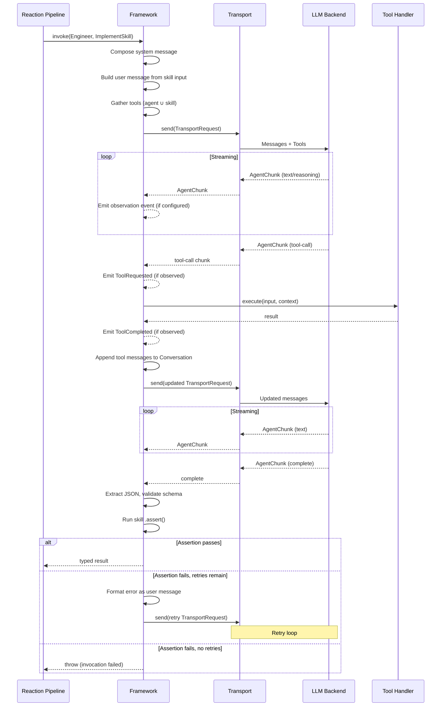

# RFC 0001: Agentic Layer Redesign

**Status:** Draft
**Date:** March 8, 2026
**Author:** Ductus Framework Architects

---

## 1. Motivation

Ductus is an event sourcing framework for building semi or fully automated agentic workflows. Its event sourcing core — the kernel, multiplexer strategies, backpressure, sequencer, ledger, processors, clusters, concurrent handlers — is production-grade. The agentic layer, however, has the right shape but not the right depth. It is agent-aware, not yet agent-first.

This RFC redesigns the agentic layer to make agents first-class citizens of the framework, with the same declarative quality as `Ductus.reaction()` and `Ductus.processor()`.

### 1.1 What Is Production-Grade Today

The event sourcing foundation requires no redesign:

- **Store/Reducer** — synchronous state derivation from events, CQRS pattern
- **Processors** — async generators consuming committed events, yielding new event drafts
- **Sequencer** — mutex-serialized event commits, hash chaining, ledger append
- **Multiplexer strategies** — BlockingMultiplexer, FailFirstMultiplexer, ThrottleMultiplexer with configurable backpressure
- **EventChannel** — universal per-processor event delivery with drain signaling
- **IntentProcessor** — processor lifecycle management, consuming/producing mode distinction
- **Kernel** — orchestration, boot, store mounting, cascade events, shutdown
- **Ledger** — append-only JSONL persistence with hash-chain integrity verification
- **Clusters** — `FixedPoolCoordinator` and `DynamicPoolCoordinator` with distribution strategies (round-robin, least-busy, partition-by) and scaling policies
- **Concurrent processors** — semaphore-based concurrency with framework-managed tool loop

### 1.2 What Is Structurally Sound but Functionally Thin

The agentic layer has correct abstractions that need deepening:

- **Agent identity model** — persona, role, rules, rulesets, systemPrompt, scope, handoff. Well-modeled, composable, template-driven.
- **Agent lifecycle** — token limits, failure tracking, hallucination tracking, turn-scoped lifetimes, handoff with event context windowing. Functional but incomplete (hallucination tracking declared, never wired).
- **Skill I/O contracts** — input schema + optional template + output schema. Good typed signatures.
- **Interceptor pipeline** — `AgentInterceptor` with `next()` chaining. Sound middleware pattern.
- **Reaction pipeline** — invoke/map/assert/case/emit. Expressive for linear workflows.

### 1.3 What Is Missing

**Tool use.** `AgentChunkToolCall` exists as a type, but there is no framework-level tool execution loop. The adapter must manage the entire tool loop internally. Tools are invisible to the event system — no observability, no framework control, no event trail.

**Streaming in pipelines.** The reaction pipeline calls `dispatcher.invokeAndParse()` which collects all chunks and discards intermediate output. The streaming `invoke()` method exists but is unused by the declarative pipeline. `AgentChunkReasoning`, `AgentChunkToolCall`, `AgentChunkUsage` are consumed and thrown away.

**Multi-turn conversation.** `AgentContext.messages` goes into `adapter.initialize()` and is never seen again. The framework has zero visibility into conversation state. It cannot truncate, summarize, inject context, or manage the context window. `maxContextTokens` triggers full adapter replacement — the only available policy.

**Observability.** Agent invocations produce no events in the ledger. When the reaction pipeline calls `invokeAndParse`, the invocation is invisible. No `AgentInvoked`, `AgentCompleted`, `AgentFailed`, `ToolCalled`, `ToolCompleted` event trail exists.

**Hallucination tracking.** `AgentEntity.maxRecognizedHallucinations` and `AgentLifecycleState.hallucinations` are declared but nothing increments `state.hallucinations`. The `assert` pipeline step could feed into this, but there is no connection.

### 1.4 Specific Problems in the Current Implementation

**The Adapter is a huge object.** It conflates four concerns:

```typescript
// CURRENT — to be replaced
interface AgentAdapter {
  initialize(context?: AgentContext): Promise<void>  // session management
  process(context: InvocationContext): AsyncIterable<AgentChunk>  // transport
  parse(chunks: AgentChunk[]): any  // output interpretation
  terminate(): Promise<void>  // lifecycle
}
```

- `parse` is not a transport concern. The skill defines the output schema — the framework should validate against it. A CLI adapter and an API adapter should not each implement their own JSON extraction.
- `initialize` receives the full `AgentContext` because the adapter owns the conversation. But if the framework does not own the conversation, it cannot truncate, summarize, inspect, or window it.

**The Dispatcher is a huge object.** `AgentDispatcher` manages agent lookup, lifecycle state, prompt composition, template rendering, interceptor pipeline, adapter lifecycle, handoff context, and turn tracking — all tangled in one 520-line class. Adding tool support would require surgery.

**InvocationContext is a mutable grab-bag:**

```typescript
// CURRENT — to be replaced
interface InvocationContext {
  agentName: string
  skillName: string
  input: unknown
  agentTuple?: AgentTuple
  skill?: SkillEntity
  prompt?: string              // starts undefined, set by interceptor
  state?: AgentLifecycleState
  data: Map<string, any>       // untyped escape hatch
}
```

Interceptors mutate this as it passes through. `prompt` starts as `undefined`; the `TemplateInterceptor` sets it. If the interceptor does not run, the adapter throws. `data` is an untyped `Map` — implicit coupling through mutation.

**The conversation is a black box.** `AgentContext.messages` enters `initialize()` and is never seen again. The framework cannot add tool call/result message pairs, truncate old messages, inject new system context mid-conversation, or inspect what the agent "knows."

---

## 2. Design Principles

1. **Everything is events.** All agentic activity — invocations, tool calls, completions, failures — should be translatable to events that flow through the multiplexer and are observable by any processor.

2. **Separation of concerns.** Transport, conversation management, tool execution, output parsing, and lifecycle management are distinct responsibilities. No single component should own more than one.

3. **Skills are pure contracts.** A skill defines input schema, output schema, assertion, and retry budget. It has no side effects, no transforms, no observations, no model, no transport.

4. **Agents own runtime configuration.** The agent declares its identity, capabilities, constraints, infrastructure defaults, and observation preferences. The flow can override infrastructure for deployment contexts.

5. **Reactions stay simple.** Complexity is expressed through events and multiple reactions, not through reaction pipeline extensions. Retries are skill-level. Tool loops are framework-level. Both are invisible to the reaction.

6. **Agent-to-agent communication is event-mediated.** This is by design, not a gap. Direct agent invocation would bypass the ledger, the reducer, and user-defined orchestration logic. The pattern `Agent A → emit → reaction → Agent B` preserves full auditability and user control.

7. **Framework owns tool loop, conversation, and output parsing.** The transport is a thin pipe: messages in, chunks out. Everything else is the framework's responsibility.

---

## 3. Tool Entity

Tools are framework-level, auditable side effects that agents can invoke during execution. The framework owns tool execution — when an LLM requests a tool call, the framework executes it, emits observation events, and feeds the result back to the transport.

### 3.1 Tool Builder (DSL)

```typescript
const RunTests = Ductus.tool('RunTests')
  .description('Execute the test suite and return results')
  .input(Ductus.object({ path: Ductus.string() }))
  .execute(async (input, { getState, use, emit }) => {
    const runner = use(TestRunner)
    const result = await runner.run(input.path)
    emit(TestsExecuted({ path: input.path, ...result }))
    return result
  })

const ReadFile = Ductus.tool('ReadFile')
  .description('Read a file from the workspace')
  .input(Ductus.object({ path: Ductus.string() }))
  .execute(async (input, { use }) => {
    return await use(FileSystem).read(input.path)
  })
```

### 3.2 Tool Interfaces

```typescript
interface ToolEntity {
  name: string
  description: string
  inputSchema: Schema
  execute: (input: unknown, context: ToolContext) => Promise<unknown>
}

interface ToolContext<TState = unknown> {
  getState: () => TState
  use: <T>(token: string) => T
  emit: (event: BaseEvent) => void
}
```

Tools can emit events via `emit()`. These events flow through the normal event pipeline — committed by the sequencer, broadcast by the multiplexer, observed by processors. A "run tests" tool can emit `TestsExecuted({ passed: 5, failed: 2 })` as a durable event.

### 3.3 Tool Schema for LLM Function Calling

When the framework sends tools to the transport, it converts `ToolEntity` to `ToolSchema` — a JSON Schema representation compatible with LLM function calling APIs:

```typescript
interface ToolSchema {
  name: string
  description: string
  parameters: Record<string, unknown>  // JSON Schema derived from inputSchema
}
```

### 3.4 Tool Placement

Tools are attached at two levels:

- **Agent-level** — generic toolbox (file I/O, shell, web search). Available for all skills on this agent.
- **Skill-level** — task-specific tools (RunTests for implement skill, not for review skill).

The merge rule for any invocation:

```
available tools = agent.tools ∪ skill.tools
```

```typescript
const Engineer = Ductus.agent('engineer')
  .tool(ReadFile)                                        // agent-level: available for all skills
  .tool(WriteFile)                                       // agent-level
  .skill(ImplementSkill, { tools: [RunTests, Lint] })    // skill-level: only for this skill
  .skill(ReviewSkill)                                    // no skill-specific tools
```

When `Engineer` is invoked with `ImplementSkill`, the available tools are: `ReadFile`, `WriteFile`, `RunTests`, `Lint`. When invoked with `ReviewSkill`, only: `ReadFile`, `WriteFile`.

---

## 4. Skill Entity

Skills are pure contracts. They define what an agent can do — the input it accepts and the output it produces. Skills have no side effects, no transforms, no observations, no model, and no transport.

### 4.1 Skill Builder (DSL)

```typescript
const ImplementSkill = Ductus.skill('implement')
  .input(
    Ductus.object({ task: Ductus.string(), context: Ductus.string() }),
    'implement.mx',  // optional template path
  )
  .output(Ductus.object({
    code: Ductus.string(),
    files: Ductus.array(Ductus.string()),
  }))
  .assert(async (output, { use, getState }) => {
    const fs = use(FileSystem)
    for (const file of output.files) {
      if (!await fs.exists(file)) {
        throw new Error(`Claimed file ${file} does not exist`)
      }
    }
  })
  .maxRetries(3)
```

### 4.2 Skill Interface

```typescript
interface SkillEntity {
  name: string
  input: {
    schema: Schema
    payload?: string  // template path
  }
  output: Schema
  assert?: (output: unknown, context: SkillAssertContext) => void | Promise<void>
  maxRetries?: number
  tools?: ToolEntity[]
}

interface SkillAssertContext<TState = unknown> {
  use: <T>(token: string) => T
  getState: () => TState
}
```

### 4.3 Semantic Assertion (`.assert()`)

Structural integrity (Zod schema validation) is necessary but not sufficient. An agent can return `{ testsRun: true, allPassing: true }` that matches the schema perfectly and be lying.

`.assert()` provides semantic validation — it verifies that the data is actually correct, not just structurally valid. It runs automatically after every invocation of the skill, regardless of which reaction triggered it.

Execution order:
1. Agent produces output
2. Framework extracts JSON from response
3. Framework validates against skill's output schema (structural)
4. Framework runs `.assert()` if defined (semantic)
5. If assertion passes: result flows to the reaction pipeline
6. If assertion throws: retry logic activates (see 4.4)

The reaction pipeline's `.assert()` step remains for reaction-specific validation that does not belong on the skill.

### 4.4 Retry with Feedback (`.maxRetries()`)

When output validation or assertion fails, the framework can automatically retry by sending the error back to the agent as feedback:

```
invoke agent with skill
  → agent produces output
  → output fails assertion
  → retry 1: format error as user message, re-invoke agent
  → agent produces corrected output
  → output passes assertion → success (agent.failures unchanged)

  OR

  → retry 3: maxRetries exhausted
  → invocation FAILS
  → agent.failures++
  → if agent.failures >= agent.maxFailures → replace agent (handoff)
```

`maxRetries` is a **per-invocation** concern (skill-level). It gives the agent a chance to self-correct within one task. `maxFailures` is a **per-agent-lifetime** concern. It recognizes a fundamentally broken agent that needs replacement.

| Concern | Scope | What happens when exhausted |
|---|---|---|
| `maxRetries` | Per-invocation (skill) | Invocation fails, `agent.failures++` |
| `maxFailures` | Per-agent-lifetime | Agent replaced via handoff |
| `maxRecognizedHallucinations` | Per-agent-lifetime | Agent replaced via handoff |

### 4.5 What Skills Do NOT Own

- **Model** — skills do not know what model runs them
- **Transport** — skills do not know what backend executes them
- **Observations** — monitoring is an operational concern, not a contractual one
- **Transforms** — `.map()` would change the output shape, breaking the contract
- **Side effects** — event emission is a workflow concern (reactions and tools)

If the same transform must happen for every invocation of a skill, extract it into a reusable function:

```typescript
const normalizeImplementOutput = (output, ctx) => ({
  ...output,
  actor: { kind: 'agent', id: ctx.agent.name },
})

// Reaction A
.invoke(Engineer, ImplementSkill).map(normalizeImplementOutput).emit(TaskCompleted)

// Reaction B
.invoke(Engineer, ImplementSkill).map(normalizeImplementOutput).emit(HotfixCompleted)
```

---

## 5. Agent Entity

Agents are the central entity of the agentic layer. An agent declares its identity, capabilities, constraints, infrastructure preferences, and operational profile.

### 5.1 Agent Builder (DSL)

```typescript
const Engineer = Ductus.agent('engineer')
  // Identity
  .role('Senior Software Engineer')
  .persona('You are a senior software engineer with 10 years of experience...')
  .rule('Always run tests before claiming implementation is complete')
  .rule('Never modify files outside the designated workspace')
  .ruleset(SecurityRules)
  .systemPrompt({ template: 'engineer-context.mx' })

  // Capabilities
  .skill(ImplementSkill, { model: Ductus.model('claude-4-opus') })
  .skill(ReviewSkill)
  .tool(ReadFile)
  .tool(WriteFile)

  // Infrastructure defaults
  .defaultModel(Ductus.model('claude-4-sonnet'))
  .defaultTransport(Ductus.transport.anthropic({ apiKey: process.env.ANTHROPIC_KEY }))

  // Lifecycle constraints
  .scope('feature')
  .maxContextTokens(100_000)
  .maxFailures(3)
  .maxRecognizedHallucinations(2)
  .timeout(300_000)

  // Context management
  .contextPolicy('summarize')
  // or: .contextPolicy(new SummarizeContextPolicy({ targetTokens: 50_000, preserveLastN: 5 }))

  // Observation
  .observe(Ductus.events.AgentCompleted)
  .observe(Ductus.events.ToolCompleted, { volatility: 'durable' })
  .observeSkill(ImplementSkill)

  // Handoff
  .handoff({ reason: 'overflow', template: 'engineer-handoff.mx', headEvents: 5, tailEvents: 50 })
  .handoff({ reason: 'failure', template: 'engineer-failure.mx' })
  .handoff({ reason: 'scope', template: 'engineer-rotation.mx', agentSummary: true })
```

### 5.2 Model and Transport Ownership

**Agent owns, skill does not.** A skill is a job description. It does not care what model runs it. Different agents can use different models for the same skill:

```typescript
const SeniorEngineer = Ductus.agent('senior-engineer')
  .defaultModel(Ductus.model('claude-4-opus'))
  .skill(ImplementSkill)

const JuniorEngineer = Ductus.agent('junior-engineer')
  .defaultModel(Ductus.model('claude-4-sonnet'))
  .skill(ImplementSkill)  // same skill, cheaper model
```

Per-skill model and transport overrides within one agent:

```typescript
Ductus.agent('engineer')
  .defaultModel(Ductus.model('claude-4-sonnet'))
  .defaultTransport(Ductus.transport.anthropic({ apiKey: '...' }))
  .skill(ImplementSkill, {
    model: Ductus.model('claude-4-opus'),  // expensive skill gets better model
  })
  .skill(ImageAnalysisSkill, {
    model: Ductus.model('gpt-4o'),
    transport: Ductus.transport.openai({ apiKey: '...' }),  // different provider
  })
  .skill(ReviewSkill)  // uses defaults
```

The hierarchy: **skill has no opinion → agent provides default → agent overrides per-skill → flow overrides agent.**

### 5.3 Flow-Level Overrides (Dependency Injection)

Agent defaults are overridable at the flow level. This enables the same agent identity to be reused across environments (dev, staging, prod) and configurations (A/B testing, cost optimization):

```typescript
// Agent declares its defaults
const Engineer = Ductus.agent('engineer')
  .skill(ImplementSkill)
  .defaultModel(Ductus.model('claude-4-sonnet'))
  .defaultTransport(Ductus.transport.anthropic({ apiKey: '...' }))

// Flow uses defaults
Ductus.flow()
  .agent(Engineer)

// Flow overrides for different environment
Ductus.flow()
  .agent(Engineer, { model: Ductus.model('claude-4-opus') })

// Agent with NO defaults — flow MUST provide
const BaseEngineer = Ductus.agent('engineer')
  .skill(ImplementSkill)
  // no defaultModel, no defaultTransport

Ductus.flow()
  .agent(BaseEngineer, { model: prodModel, transport: apiTransport })  // required
```

### 5.4 Context Policy

When `maxContextTokens` is approached, the framework applies the configured context policy. This is an interface with implementations, following the same pattern as multiplexer strategies and scaling policies.

```typescript
interface ContextPolicy {
  apply(
    conversation: Conversation,
    limit: number,
    transport: AgentTransport,
    model?: string,
  ): Promise<Conversation>
}
```

The `transport` parameter is needed by `SummarizeContextPolicy` — it must invoke the LLM to produce a summary. Other policies do not use it.

**Implementations:**

| Policy | Behavior |
|---|---|
| `ReplaceContextPolicy` | Terminate adapter, create fresh with handoff context (current behavior) |
| `TruncateContextPolicy` | Remove oldest messages, keep system message + last N messages |
| `SummarizeContextPolicy` | Ask agent to summarize conversation, replace history with summary |
| `SlidingWindowContextPolicy` | Keep the last N tokens worth of messages, always |

**String shortcuts** map to default-configured implementations:

```typescript
.contextPolicy('replace')        // new ReplaceContextPolicy()
.contextPolicy('truncate')       // new TruncateContextPolicy()
.contextPolicy('summarize')      // new SummarizeContextPolicy()
.contextPolicy('sliding-window') // new SlidingWindowContextPolicy()
```

**Full control:**

```typescript
.contextPolicy(new SummarizeContextPolicy({
  targetTokens: 50_000,
  preserveSystem: true,
  preserveLastN: 5,
}))
```

### 5.5 Observation Configuration

Observation is an operational concern, not a contractual one. It is configured on the agent, not on skills. The same skill used by different agents can have different observation configurations.

```typescript
Ductus.agent('engineer')
  // Agent-level events
  .observe(Ductus.events.AgentCompleted)
  .observe(Ductus.events.AgentReplaced, { volatility: 'durable' })

  // Skill-level events, configured on the agent
  .observeSkill(ImplementSkill)                              // all events for this skill
  .observeSkill(ReviewSkill, Ductus.events.SkillFailed)      // only failures for this skill

  // Tool-level events
  .observe(Ductus.events.ToolCompleted, { volatility: 'durable' })

  // Catch-all
  .observeAll()                         // everything, volatile
  .observeAll({ volatility: 'durable' }) // everything, persisted to ledger
```

When `.observeSkill(skill)` is called with no event arguments, it means "all skill-level events for this skill" — the skill-scoped equivalent of `.observeAll()`.

Observation events are emitted only if the agent has opted in. They flow through the multiplexer like any other event. Any processor can subscribe:

```typescript
Ductus.processor('StreamLogger', async function* (events) {
  for await (const event of events) {
    if (Ductus.events.AgentStreamChunk.is(event)) {
      console.log(`[${event.payload.agent}] ${event.payload.chunk.content}`)
    }
  }
})
```

---

## 6. Reaction Pipeline

### 6.1 Current Capabilities (Preserved)

The reaction pipeline provides a declarative workflow for agent invocations:

```typescript
Ductus.reaction('implement')
  .when(TaskAssigned)
  .invoke(Engineer, ImplementSkill)
  .map((output, ctx) => ({
    ...output,
    actor: { kind: 'agent', id: ctx.agent.name },
  }))
  .assert((data, ctx) => {
    if (data.files.length === 0) throw new Error('No files changed')
  })
  .case(ApprovalSchema, Ductus.emit(TaskApproved))
  .case(RejectionSchema, Ductus.emit(TaskRejected))
  .error((err, ctx) => ({
    error: err.message,
    agent: ctx.agent?.name,
    trigger: ctx.triggerEvent.type,
  }))
  .emit(TaskFailed)
```

Pipeline steps: `invoke`, `map`, `assert`, `case`, `emit`, `error`. These remain unchanged.

### 6.2 Honest Assessment of Limitations

Reactions are good for linear, single-agent, single-invocation workflows. They cannot:

- **Retry with feedback** — if the agent produces bad output, the only options are `.error()` (transform and continue) or throw (kill the pipeline). Addressed by skill-level `.maxRetries()`.
- **Conditionally select agents** — "if priority=high, invoke SeniorEngineer; else invoke JuniorEngineer." Use two reactions with different `.when()` predicates, or use a processor.
- **Invoke multiple agents** — Agent A → Agent B requires two reactions mediated by an intermediate event. This is correct for event sourcing — every intermediate step is in the ledger.
- **Observe streaming** — the reaction calls `invokeAndParse` and blocks until completion. Streaming observation is handled by separate processors consuming volatile observation events.

### 6.3 Position: Stay Simple

Reactions should not be extended with loops, branches, or parallel invocations. Those belong in events (the whole point of event sourcing) or in processors (for orchestration logic).

The tool loop makes reactions more powerful without adding pipeline complexity. A single `.invoke()` step can internally do complex work — the agent calls tools, tools emit events, tools produce results, the agent continues — all invisible to the reaction pipeline. The reaction stays linear; the invocation is as complex as it needs to be.

Revisit after the tool loop, skill retries, and observation events are implemented. If real-world workflows still feel painful, extend then.

---

## 7. Flow Registration

The flow is the composition root. It registers agents, reactions, processors, and reducers. It can override agent infrastructure for the deployment context.

```typescript
Ductus.flow()
  .initialState({ tasks: [], completedCount: 0 })
  .reducer(taskReducer)
  .agent(Engineer)                                             // uses agent's defaults
  .agent(Reviewer, { model: Ductus.model('claude-4-haiku') })  // override model
  .reaction(ImplementReaction)
  .reaction(ReviewReaction)
  .processor(AuditLogger)
```

Model and transport are no longer required at the flow level when the agent has defaults. When the agent has no defaults, the flow must provide them.

---

## 8. Transport Interface

The transport replaces the current `AgentAdapter`. It is a thin pipe: messages in, chunks out. No initialization, no parsing, no lifecycle management.

### 8.1 Interface

```typescript
interface AgentTransport {
  send(request: TransportRequest): AsyncIterable<AgentChunk>
  close(): Promise<void>
}

interface TransportRequest {
  conversation: Conversation   // immutable, structural sharing — see Section 9
  newFromIndex: number         // messages[newFromIndex:] are new since last send
  tools?: ToolSchema[]
  model: string
  temperature?: number
}
```

### 8.2 Why the Transport Receives Full Conversation

The full conversation is always provided via the immutable `Conversation` object. The `newFromIndex` field marks where new messages begin since the last `send()` call.

- **API transports** (stateless): read `conversation.messages` and send everything to the LLM.
- **CLI transports** (stateful): read `conversation.messages.slice(newFromIndex)` and write only new messages to stdin.
- **Either** can access the full history if needed.

The transport never holds a reference to a conversation manager or any framework-internal abstraction. It receives data, not dependencies. This keeps transports pure, testable (construct a `TransportRequest`, assert on output), and easy to implement (no framework knowledge required).

### 8.3 What Was Removed from the Adapter

| Removed | Reason | New owner |
|---|---|---|
| `initialize(context)` | Session management | Framework — manages `Conversation` lifecycle |
| `parse(chunks)` | Output interpretation | Framework — validates against skill output schema |
| `terminate()` | Lifecycle | Replaced by `close()` — simpler contract |
| Conversation ownership | Implicit state | Framework — `Conversation` is framework-managed |

### 8.4 Transport Builder (DSL)

```typescript
// API transport
Ductus.transport.anthropic({
  apiKey: process.env.ANTHROPIC_KEY,
})

// CLI transport
Ductus.transport.cli({
  command: 'claude',
  args: ['--json'],
  cwd: process.cwd(),
  env: { API_KEY: process.env.ANTHROPIC_KEY },
  timeoutMs: 300_000,
})
```

---

## 9. Conversation

The framework owns the conversation. It is represented as an immutable data structure with structural sharing.

### 9.1 Immutable Conversation Class

Every operation returns a new `Conversation`. No mutation methods exist. The transport receives a `Conversation` reference and cannot corrupt it.

```typescript
class Conversation {
  private constructor(
    private readonly _system: string,
    private readonly _head: ConversationNode | null,
    private readonly _length: number,
    private readonly _tokenEstimate: number,
  ) {}

  static create(systemMessage: string): Conversation {
    return new Conversation(systemMessage, null, 0, 0)
  }

  append(message: AgenticMessage): Conversation {
    return new Conversation(
      this._system,
      { message, prev: this._head },
      this._length + 1,
      this._tokenEstimate + estimateTokens(message),
    )
  }

  get messages(): readonly AgenticMessage[] {
    const result: AgenticMessage[] = new Array(this._length)
    let current = this._head
    for (let i = this._length - 1; i >= 0; i--) {
      result[i] = current!.message
      current = current!.prev
    }
    return Object.freeze(result)
  }

  get systemMessage(): string { return this._system }
  get tokenEstimate(): number { return this._tokenEstimate }
  get length(): number { return this._length }
}

interface ConversationNode {
  message: AgenticMessage
  prev: ConversationNode | null
}
```

**Structural sharing:** `append()` is O(1) — it creates a new node pointing to the existing chain. Previous `Conversation` instances remain valid with their original data. Multiple conversations can share the same prefix chain.

**Materialization:** `get messages()` is O(n) — it traverses the linked list and produces a frozen array. This runs only when the transport needs the full message list.

### 9.2 Framework Conversation Lifecycle

1. Agent initialized → `Conversation.create(systemMessage)`
2. Each invocation → `conversation.append(userMessage)`
3. Transport called → transport receives `conversation` reference
4. As chunks arrive → framework builds assistant response
5. Tool call → `conversation.append(toolCallMessage).append(toolResultMessage)`
6. Completion → `conversation.append(assistantMessage)`
7. Token count updated → `conversation.tokenEstimate`
8. Context policy applied if approaching `maxContextTokens`

---

## 10. Invocation Sequence

When the reaction pipeline hits `.invoke(Engineer, ImplementSkill)`, the framework executes the following sequence:

```
1. CONTEXT ASSEMBLY
   ├── Compose system message (persona + rules + systemPrompt)
   ├── Build user message (skill input → template → message)
   ├── Collect conversation history (framework-managed Conversation)
   ├── Gather available tools (agent.tools ∪ skill.tools)
   └── Apply context policy if approaching token limit
         ↓
2. TRANSPORT
   ├── Build TransportRequest with Conversation, tools, model, temperature
   ├── Call transport.send(request)
   └── Begin receiving AsyncIterable<AgentChunk>
         ↓
3. AGENT LOOP (may repeat for tool calls)
   ├── Stream chunks → emit volatile observation events (if configured)
   ├── If tool-call chunk:
   │   ├── Emit ToolRequested event (if observed)
   │   ├── Validate tool arguments against tool's input schema
   │   ├── Execute tool via registered handler
   │   ├── Emit ToolCompleted event (if observed)
   │   ├── Append tool-call + tool-result messages to Conversation
   │   └── Send updated Conversation to transport → back to streaming
   └── If complete chunk: exit loop
         ↓
4. OUTPUT
   ├── Collect all text chunks into raw response
   ├── Extract JSON (JSON mode if available, regex extraction fallback)
   ├── Validate against skill's output schema (Zod parse)
   └── Return validated, typed result
         ↓
5. SKILL ASSERTION
   ├── Run skill's .assert() if defined
   ├── If assertion passes: continue to step 6
   └── If assertion throws:
       ├── If retries remain: format error as user message, go to step 2
       └── If maxRetries exhausted: invocation FAILS
         ↓
6. OBSERVATION & LIFECYCLE
   ├── Emit AgentCompleted or AgentFailed event (if observed)
   ├── Update lifecycle state (tokensUsed, turns, failures)
   ├── Check lifecycle limits (maxFailures, maxContextTokens, scope)
   └── Trigger handoff/replacement if limits exceeded
         ↓
7. PIPELINE CONTINUES
   └── Return result to reaction → map → assert → case → emit
```



---

## 11. Observation Model

### 11.1 Framework-Provided Event Definitions

The framework ships a set of well-known event definitions under `Ductus.events.*`. Users do not define these — they select which ones to observe.

**Agent-level events:**

| Event | Payload | Description |
|---|---|---|
| `AgentInvoked` | `{ agent, skill, inputHash }` | Agent started working |
| `AgentCompleted` | `{ agent, skill, durationMs, tokenUsage: { input, output, total } }` | Agent finished successfully |
| `AgentFailed` | `{ agent, skill, error }` | Agent invocation failed |
| `AgentReplaced` | `{ agent, reason, newAgent }` | Agent hit lifetime limit, replaced via handoff |
| `AgentStreamChunk` | `{ agent, skill, chunk }` | Raw streaming chunk (real-time observation) |

**Skill-level events:**

| Event | Payload | Description |
|---|---|---|
| `SkillInvoked` | `{ agent, skill, inputHash }` | Skill invocation started |
| `SkillCompleted` | `{ agent, skill, durationMs }` | Skill completed, output validated |
| `SkillFailed` | `{ agent, skill, error, retriesExhausted }` | Skill failed after exhausting retries |
| `SkillRetry` | `{ agent, skill, attempt, maxRetries, error }` | Skill output rejected, retrying |

**Tool-level events:**

| Event | Payload | Description |
|---|---|---|
| `ToolRequested` | `{ agent, tool, arguments }` | Agent requested tool execution |
| `ToolCompleted` | `{ agent, tool, durationMs, resultSummary }` | Tool execution completed |

### 11.2 Default Volatility

Stream chunks and intermediate events are volatile by default (broadcast to processors but not persisted to the ledger). Final events (AgentCompleted, AgentFailed) can be made durable via configuration.

### 11.3 Consuming Observation Events

Observation events flow through the multiplexer like any other event. Any processor can subscribe:

```typescript
Ductus.processor('AgentMonitor', async function* (events) {
  for await (const event of events) {
    if (Ductus.events.AgentCompleted.is(event)) {
      const { agent, skill, durationMs, tokenUsage } = event.payload
      console.log(`[${agent}/${skill}] completed in ${durationMs}ms, ${tokenUsage.total} tokens`)
    }
    if (Ductus.events.SkillRetry.is(event)) {
      const { agent, skill, attempt, maxRetries, error } = event.payload
      console.warn(`[${agent}/${skill}] retry ${attempt}/${maxRetries}: ${error}`)
    }
  }
})
```

The invoking reaction does not see observation events — it only receives the final parsed result. Observation is decoupled from the workflow.

---

## 12. Chunk Vocabulary

The `AgentChunk` discriminated union defines the protocol between transport and framework:

```typescript
interface AgentChunkBase {
  type: string
  timestamp: number
}

interface AgentChunkReasoning extends AgentChunkBase {
  type: 'reasoning'
  content: string
}

interface AgentChunkText extends AgentChunkBase {
  type: 'text'
  content: string
}

interface AgentChunkToolCall extends AgentChunkBase {
  type: 'tool-call'
  toolCall: {
    id: string
    name: string
    arguments: string
  }
}

interface AgentChunkToolResult extends AgentChunkBase {
  type: 'tool-result'
  toolCallId: string
  result: unknown
}

interface AgentChunkError extends AgentChunkBase {
  type: 'error'
  reason: string
}

interface AgentChunkUsage extends AgentChunkBase {
  type: 'usage'
  inputTokens: number
  outputTokens: number
}

interface AgentChunkData extends AgentChunkBase {
  type: 'data'
  data: unknown
}

interface AgentChunkComplete extends AgentChunkBase {
  type: 'complete'
}

type AgentChunk =
  | AgentChunkReasoning
  | AgentChunkText
  | AgentChunkToolCall
  | AgentChunkToolResult
  | AgentChunkError
  | AgentChunkUsage
  | AgentChunkData
  | AgentChunkComplete
```

| Chunk | Direction | Meaning |
|---|---|---|
| `reasoning` | LLM → framework | Model's chain-of-thought |
| `text` | LLM → framework | Output text |
| `tool-call` | LLM → framework | Model requests tool execution |
| `tool-result` | framework → LLM | Framework returns tool execution result |
| `usage` | LLM → framework | Token usage report |
| `error` | Either direction | Something went wrong |
| `data` | LLM → framework | Structured data (native JSON mode) |
| `complete` | LLM → framework | Generation finished |

---

## 13. Ownership Summary

| Entity | Owns | Does NOT own |
|---|---|---|
| **Skill** | I/O schemas, `.assert()`, `.maxRetries()`, skill-specific tools | Model, transport, observations, transforms, side effects |
| **Agent** | Identity (persona, role, rules), skills, tools, observations, lifecycle limits, context policy, model/transport defaults, handoff config | — |
| **Tool** | Name, description, input schema, execute function | — |
| **Reaction** | Event wiring, pipeline (invoke → map → assert → case → emit → error) | Retry logic (skill), tool loop (framework), streaming (observation events) |
| **Flow** | Agent registration, model/transport overrides, reducers, reactions, processors, initial state | Agent identity |
| **Transport** | Sending messages, receiving chunks, closing connection | Conversation, parsing, session management, tool execution |
| **Framework** | Conversation management, tool execution loop, output parsing, observation event emission, lifecycle enforcement, context policy application | — |

---

## 14. Schema Strategy

### 14.1 Current State

The schema abstraction uses Zod directly:

```typescript
// src/interfaces/schema.ts — CURRENT
import { ZodSchema } from 'zod/v3'
export type Schema = ZodSchema
```

This leaks Zod into the public API. Every interface that uses `Schema` (`SkillEntity`, `CaseStep`, `ReducerBuilder`, etc.) exposes Zod as a transitive dependency.

### 14.2 Decision

**Keep Zod, but behind the `Ductus.*` facade.** Users write:

```typescript
Ductus.object({ title: Ductus.string(), count: Ductus.number() })
```

These are Zod wrappers internally. The user-facing API does not change if the underlying library is swapped.

### 14.3 Future Refactor (Not Blocking)

Wrap `Schema` behind a framework-owned interface to eliminate the Zod leak:

```typescript
export interface Schema {
  parse(data: unknown): unknown
  safeParse(data: unknown): { success: boolean; data?: unknown; error?: unknown }
  toJsonSchema(): Record<string, unknown>  // needed for LLM tool calling
}
```

`Ductus.object()`, `Ductus.string()`, etc. would return objects implementing this interface using Zod internally. Users would never import from `zod` directly. This refactor is not blocking current work — the design decisions in this RFC do not depend on which schema library is underneath.

Skill output is always JSON. Zod defines JSON schemas. There is no benefit to supporting other output formats (markdown, XML) at the skill level.

---

## 15. Key Design Decisions

### 15.1 Agent-to-Agent Communication Through Events Only

**Decision:** Agents do not directly invoke other agents. All inter-agent communication flows through events.

**Pattern:** Agent A → emit event → reaction → invoke Agent B → emit event

**Rationale:** Direct agent invocation would bypass the ledger, the reducer, and user-defined orchestration logic. The event-mediated pattern preserves full auditability and gives the user control over which agents can communicate, when, and how.

### 15.2 Skills Are Pure Contracts

**Decision:** Skills define input/output schemas, semantic assertion, and retry budget. They have no side effects, transforms, observations, model, or transport.

**Rationale:** A skill is a job description, not a workflow. If a skill could emit events or transform output, it would be a mini-pipeline that muddies the abstraction boundary. Transforms are reaction-level concerns. Side effects belong in tools. Observations are agent-level operational concerns.

### 15.3 Reactions Stay Simple

**Decision:** Do not add loops, conditional agent selection, or parallel invocations to reactions. Revisit after tool loop and skill retries are implemented.

**Rationale:** Complex orchestration should be expressed through events and multiple reactions. This is the fundamental premise of event sourcing. The tool loop makes reactions more powerful without adding pipeline complexity — a single `.invoke()` can do arbitrarily complex work internally.

### 15.4 Framework Owns Tool Loop

**Decision:** When an LLM requests a tool call, the framework executes it. The transport yields a `tool-call` chunk, the framework handles execution, and feeds the result back.

**Rationale:** Tools are auditable side effects. They can emit events, access state, and use DI. If the adapter owns the tool loop, all of this is invisible to the event system. Framework ownership enables observability (`ToolRequested`, `ToolCompleted` events), permission enforcement, and audit trails.

### 15.5 Framework Owns Conversation

**Decision:** The framework manages conversation history via the immutable `Conversation` data structure. The transport receives conversation data but does not own it.

**Rationale:** If the adapter owns the conversation, the framework cannot truncate, summarize, inject context, or inspect the conversation window. `maxContextTokens` becomes a nuclear option (full replacement) instead of a manageable policy. Framework ownership enables context policies (truncate, summarize, sliding window, replace).

### 15.6 Framework Owns Output Parsing

**Decision:** Output parsing (extracting structured JSON from agent response, validating against skill output schema) is a framework concern, not a transport concern.

**Rationale:** Parsing depends on the skill's output schema, not on the transport. A CLI adapter and an API adapter should not each implement their own JSON extraction. The framework extracts JSON, validates against the skill's Zod schema, and returns a typed result.

### 15.7 Transport Is a Thin Pipe

**Decision:** The `AgentTransport` interface has two methods: `send(request)` and `close()`. No initialization, no parsing, no lifecycle management.

**Rationale:** Simplicity enables testability (construct a request, assert on output), implementability (transport authors need only the request/response shapes), and interchangeability (swap transports without touching framework logic).

### 15.8 Immutable Conversation with Structural Sharing

**Decision:** Conversation is an immutable data structure. `append()` returns a new instance in O(1) via linked-list nodes. Old instances remain valid.

**Rationale:** Passing a conversation reference to the transport must not allow the transport to corrupt framework state. Immutability guarantees this structurally — no mutation methods exist. Structural sharing (shared predecessor nodes) makes appends efficient.

### 15.9 Agent Owns Model/Transport with Flow Overrides

**Decision:** Agents declare default model and transport. The flow (composition root) can override for deployment contexts.

**Rationale:** This is dependency injection. The agent declares what it needs. The flow provides the environment. Agent identity stays reusable across environments (dev, staging, prod, A/B testing) while remaining self-contained when convenient.

### 15.10 Observation Declared on Agents Only

**Decision:** Skills do not configure observations. Agents declare which events to observe, including per-skill granularity.

**Rationale:** Observation is an operational concern, not a contractual one. A skill says "I accept this input and produce this output." Whether invocations are monitored is the agent's (operator's) decision. The same skill on different agents can have different observation configurations.

### 15.11 Output Is Always JSON

**Decision:** Skill output is always structured JSON data, validated against a Zod schema.

**Rationale:** Zod defines JSON schemas. The framework needs to validate output, route via `.case()`, transform via `.map()`, and emit as event payloads. All of these require structured data. If the transport supports JSON mode, it is used. Otherwise, the framework extracts JSON from text (regex or smarter extraction).

---

## 16. Migration Path

### 16.1 Breaking Changes

| Current | Replacement | Impact |
|---|---|---|
| `AgentAdapter` interface | `AgentTransport` interface | All adapter implementations must be rewritten |
| `AgentAdapter.parse()` | Framework-level output parsing | Parsing logic moves to framework |
| `AgentAdapter.initialize()` | Framework-managed `Conversation` | Session initialization moves to framework |
| `AdapterEntity.create()` | Transport factory (TBD builder pattern) | Factory signature changes |
| `InvocationContext` (mutable) | Structured invocation pipeline | Interceptors must adapt to new context model |

### 16.2 Non-Breaking Changes

| Change | Impact |
|---|---|
| `.tool()` on agent builder | Additive — new method on existing builder |
| `.assert()` and `.maxRetries()` on skill builder | Additive — new methods on existing builder |
| `.contextPolicy()` on agent builder | Additive — new method, existing behavior is the default (`'replace'`) |
| `.defaultModel()` and `.defaultTransport()` on agent builder | Additive — flow-level model/adapter still works |
| `.observe()` and `.observeSkill()` on agent builder | Additive — no observation events emitted by default |
| `Ductus.events.*` framework event definitions | Additive — new exports |
| `Ductus.tool()` factory function | Additive — new export |

### 16.3 AgentDispatcher Decomposition

The current `AgentDispatcher` (520 lines, 8+ concerns) will be decomposed into focused components. This is an implementation detail to be addressed in a follow-up RFC after the interfaces are finalized.

---

## 17. Open Questions / Future Work

1. **Retry feedback formatting** — how is the validation error formatted as a user message for the retry attempt? Structured error object, or rendered template?

2. **Exact observation event payload shapes** — the payload tables in Section 11 are indicative. Exact TypeScript interfaces to be defined during implementation.

3. **Tool builder interface** — the `Ductus.tool()` builder shown in Section 3 needs full interface/implementation specification.

4. **`Ductus.concurrent` handler access to tools** — should concurrent handlers have access to tools, or only processor-based invocations via reactions?

5. **Reaction extensions post-implementation** — after tool loop, skill retries, and observations are implemented, evaluate whether reactions need additional capabilities.

6. **Conversation persistent vector timing** — the linked-list implementation provides O(1) structural sharing. A persistent vector (trie-based) could improve `messages` materialization from O(n) to O(log n). Evaluate when conversation sizes justify the complexity.

7. **Hallucination tracking wiring** — connect skill `.assert()` failures to `agent.hallucinations` counter. Define which assertion failures count as hallucinations vs. simple errors.

8. **Built-in API transport** — the framework should ship at least one direct API transport (Anthropic or OpenAI) that demonstrates the full agent lifecycle natively.

---

## Appendix B: Implementation Deviations

Deviations from the original RFC that were accepted during implementation. Each is documented with the RFC reference, actual implementation, and rationale.

### B.1 `duration` → `durationMs` (Section 11.1)

**RFC:** `duration` on `AgentCompleted`, `SkillCompleted`, `ToolCompleted`.
**Implementation:** `durationMs` on all three events.
**Rationale:** Explicit unit in field name eliminates ambiguity (seconds vs. milliseconds vs. nanoseconds). Self-documenting without requiring consumers to check documentation.

### B.2 `AgentCompleted.tokenUsage.total` (Section 11.1)

**RFC:** `tokenUsage: { input, output }` in the table; example code at line 839 already references `.total`.
**Implementation:** `tokenUsage: { input: number, output: number, total: number }`.
**Rationale:** Formalizes what the RFC example already assumed. Avoids repeated `input + output` at every consumer.

### B.3 `outputFormat` removed from `TransportRequest` (Section 7)

**RFC:** Not explicitly specified; pre-RFC artifact included `outputFormat?: 'text' | 'json'`.
**Implementation:** Field removed entirely.
**Rationale:** The framework owns output parsing via skill schema validation. Transport format hints couple two layers that should be independent.

### B.4 `AgentChunkData.data` typed as `unknown` (Section 6)

**RFC:** Pre-RFC artifact typed `data: any`.
**Implementation:** `data: unknown`.
**Rationale:** `unknown` forces explicit narrowing at consumer sites. Standard TypeScript safety practice — no `any` in public interfaces.

### B.5 `Schema = ZodSchema` direct coupling (Section 3)

**RFC:** References abstract `Schema` type throughout.
**Implementation:** `export type Schema = ZodSchema` with JSDoc documenting the coupling.
**Status:** Accepted for now. A runtime abstraction layer (parse, validate, infer) is significant effort with low current value. Consumers import `Schema` (not `ZodSchema`) to future-proof.

### B.6 `AssertionExhaustedError` (not in RFC)

**RFC:** Does not specify error propagation for exhausted skill retries.
**Implementation:** Custom error class carrying `assertionFailures: number`.
**Rationale:** When retries exhaust, the assertion failure count must reach the dispatcher for hallucination tracking and lifecycle reset. A plain `Error` cannot carry structured data; `instanceof` checks enable typed access.

### B.7 `PipelineContext` enriched with `getState` and `use` (Section 9)

**RFC:** Pipeline context has `agentName`, `skillName`, `triggerEvent`.
**Implementation:** Also includes `getState?: () => unknown` and `use?: Injector`.
**Rationale:** Reactions run inside processors which receive `getState` and `use`. Without forwarding them, pipeline steps (`map`, `assert`, `error`) cannot access application state or DI — making real-world reactions (e.g., assert that checks database state, map that uses a service) impossible.
