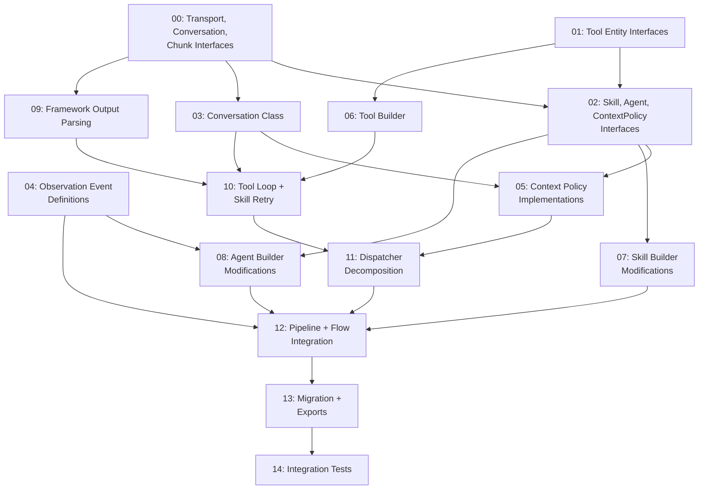

# RFC 0001 Implementation Tasks

Implementation plan for [RFC 0001: Agentic Layer Redesign](../../0001-agentic-layer-redesign.md).

---

## Dependency Graph



## Phase Overview

| Phase | Tasks | Parallelizable | Risk | Description |
|---|---|---|---|---|
| **0 — Interface Lock** | 00, 01, 02 | Partially (00, 01 parallel; 02 depends on both) | Low | Define all new/modified TypeScript interfaces. Human reviews and locks. |
| **1 — Primitives** | 03, 04, 05 | Yes (03, 04 parallel; 05 after 03) | Low | Implement standalone components with no runtime dependencies on each other. |
| **2 — Builders** | 06, 07, 08 | Yes (all three parallel) | Low | Extend the fluent DSL builders. Additive changes to existing builders. |
| **3 — Core Runtime** | 09, 10, 11 | No (strictly sequential) | **High** | Replace the invocation engine. Most complex and highest-risk tasks. |
| **4 — Integration** | 12, 13 | Partially | Medium | Wire components into framework entry points. Update exports. |
| **5 — Validation** | 14 | No | Medium | End-to-end integration test proving all components work together. |

## Critical Path

```
00 → 02 → 07 ──────────────────────┐
00 → 03 → 10 → 11 → 12 → 13 → 14  │ (longest path)
01 → 06 → 10 ──────────────────────┘
00 → 09 → 10
04 → 12
```

The longest path: **00 → 03 → 10 → 11 → 12 → 13 → 14** (7 tasks sequential).

## Task Status

| Task | Title | Status |
|---|---|---|
| 00 | [Transport, Conversation, Chunk Interfaces](00-transport-conversation-chunk-interfaces.md) | Not started |
| 01 | [Tool Entity Interfaces](01-tool-entity-interfaces.md) | Not started |
| 02 | [Skill, Agent, ContextPolicy Interfaces](02-skill-agent-contextpolicy-interfaces.md) | Not started |
| 03 | [Conversation Class](03-conversation-class.md) | Not started |
| 04 | [Observation Event Definitions](04-observation-event-definitions.md) | Not started |
| 05 | [Context Policy Implementations](05-context-policy-implementations.md) | Not started |
| 06 | [Tool Builder](06-tool-builder.md) | Not started |
| 07 | [Skill Builder Modifications](07-skill-builder-modifications.md) | Not started |
| 08 | [Agent Builder Modifications](08-agent-builder-modifications.md) | Not started |
| 09 | [Framework Output Parsing](09-framework-output-parsing.md) | Not started |
| 10 | [Tool Loop + Skill Retry](10-tool-loop-and-skill-retry.md) | Not started |
| 11 | [Dispatcher Decomposition](11-dispatcher-decomposition.md) | Not started |
| 12 | [Pipeline + Flow Integration](12-pipeline-and-flow-integration.md) | Not started |
| 13 | [Migration + Exports](13-migration-and-exports.md) | Not started |
| 14 | [Integration Tests](14-integration-tests.md) | Not started |

## Rules for Task Execution

1. **Each task is one agent session.** Do not combine tasks.
2. **Read the Exploration section first.** Understand the context before writing code.
3. **For interface tasks (00-02): copy interfaces verbatim.** No creative interpretation.
4. **For implementation tasks (03-14): follow the requirements, not the RFC prose.** The task is the spec.
5. **Run checks before reporting.** `npx tsc --noEmit` must pass after every task.
6. **Commit after every completed task.** Next task starts from a clean, compiling codebase.
7. **Request manual review before marking complete.** Zero-trust: the reviewer verifies independently.
