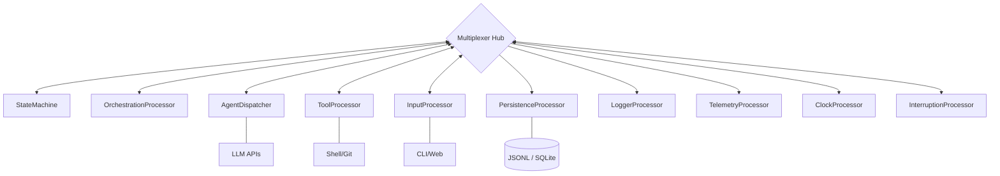

# RFC-001: Ductus v2 Architectural Blueprint

## Status: DRAFT / PENDING REVIEW
**Date:** 2026-02-24
**Topic:** Architectural Foundation for Ductus v2

---

## 1. Vision & Goals
To evolve Ductus from a sequence of scripts into a **reactive engine** capable of long-running, self-healing, and verifiable agentic orchestration.

### Key Goals:
- **Resilience:** Power-failure or crash recovery via Snapshot + Delta Replay.
- **Observability:** 100% deterministic auditing through an immutable cryptographic ledger.
- **Safety:** Zero-trust validation of LLM outputs via a specialized Orchestration layer.
- **Flexibility:** Headless-first design allowing any UI (CLI/Web) or I/O (Terminal/Slack).

---

## 2. Core Topology (The Multiplexer Hub)

The system is built as a **Circuit** of asynchronous, independent **StreamProcessors**. Every event is broadcasted concurrently to all nodes.

### 2.1 The 10 Essential Processors
1.  **StateMachine:** Pure logic. Orchestrates the high-level state (XState).
2.  **OrchestrationProcessor:** The "Bouncer." Performs Git-diff validation and manages check boundaries.
3.  **AgentDispatcher:** Manages LLM sessions and adapters.
4.  **ToolProcessor:** Executes shell commands / Git primitives.
5.  **InputProcessor:** Manages user interaction via pluggable `InputAdapters`.
6.  **ClockProcessor:** Dispatches deterministic "Time" events (TICK).
7.  **InterruptionProcessor:** Handles SIGINT/Panic signals.
8.  **PersistenceProcessor:** Records Ledger (.jsonl) and Snapshots.
9.  **LoggerProcessor:** Formats formatting for human viewing (Ink/Console).
10. **TelemetryProcessor:** Aggregates costs, tokens, and durations.

### 2.2 System Flow Diagram


---

## 3. The Ledger: Immutable Truth

Every action is a `DuctusEvent` with cryptographic chaining.

```typescript
interface DuctusEvent<T = any> {
  eventId: string;           
  authorId: string;          // Maps to specific processor/session instance
  type: string;              
  timestamp: number;         
  sequenceNumber: number;    // Assigned by Hub to guarantee absolute ordering
  prevHash: string;          // Links to the prior event
  hash: string;              // SHA-256( prevHash + authorId + sequenceNumber + payload )
  payload: T;
}
```

### 3.1 Hash Chaining Benefits
- **Deterministic Caching:** The hash of an event is a perfect representation of the state history. If `PROMPT_AGENT` produces `hash: abc`, it can be instantly fulfilled from the cache.
- **Tamper Evidence:** Any modification to a 100-event ledger breaks the entire sequence, preventing manual "doctoring" of logs.

---

## 4. The Orchestration & Zero-Trust Verification

The `OrchestrationProcessor` acts as the system's "Executive Function."

### 4.1 Verification Boundaries
| Boundary | Trigger | Validation Actions |
| :--- | :--- | :--- |
| `per_iteration` | Any agent output | `git diff --name-only` vs. Agent Claims, Linter |
| `per_task` | Task completion | Scoped tests (e.g. `jest {{files}}`), Type-checks |
| `per_feature` | Full plan completion | E2E Tests, Full Build, Compliance |

### 4.2 Hallucination Management (Quarantine Markers)
If an agent hallucinates inventory:
1. Orchestrator yields `AUTO_REJECTION`.
2. System yields `HALLUCINATION_DETECTED` for that `authorId`.
3. If limit reached, session is killed.
4. On replacement, the ledger is filtered to **ignore** events from that `authorId` following the first hallucination.

---

## 5. Bootstrapping & Recovery Flow

Run recovery is managed by a high-level `Bootstrapper`.

1. **Locate Data:** Find latest Snapshot (Sequence N).
2. **Hydrate:** Inject Snapshot into `StateMachine`.
3. **Muted Replay:** Pump events `N+1` to `Latest` through the Hub. 
    - *Note:* Dispatchers are "Muted" during replay; they receive events but do not trigger LLM calls.
4. **Ignition:** Once replayed, the Hub goes "Live."

---

## 6. Configuration Schema (`ductus.config.ts`)

Topology and logic are strictly separated from linguistic templates.

```typescript
export default {
  checks: {
    "lint": { command: "eslint .", boundary: "per_iteration" },
    "test:scoped": { command: "jest {{files}}", boundary: "per_task", requires_context: true }
  },
  roles: {
    "engineer": {
      lifecycle: "session",
      boundary: "task",
      maxRejections: 5,
      maxRecognizedHallucinations: 2,
      strategies: [
        { model: "claude-3-5-sonnet", template: "./prompts.md/eng.mx", maxRetries: 3 },
        { model: "gpt-4o", template: "./prompts.md/eng-openai.mx", maxRetries: 2 }
      ]
    }
  }
}
```

---

## 7. Implementation Roadmap
- **Phase 1:** Core Circuit & Hub (The Nervous System)
- **Phase 2:** StateMachine & Orchestration (The Brain)
- **Phase 3:** Agent Adapters & LLM Routing (The Intelligence)
- **Phase 4:** Persistence & Recovery (The Memory)
- **Phase 5:** UI/CLI (The Body)
