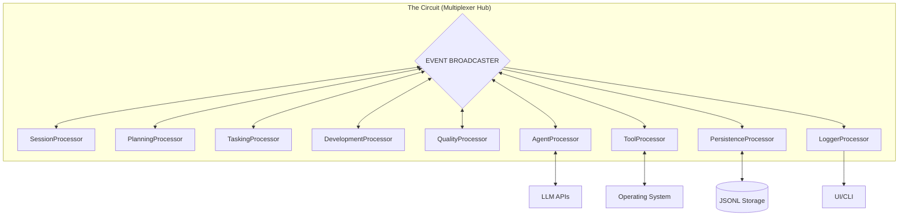
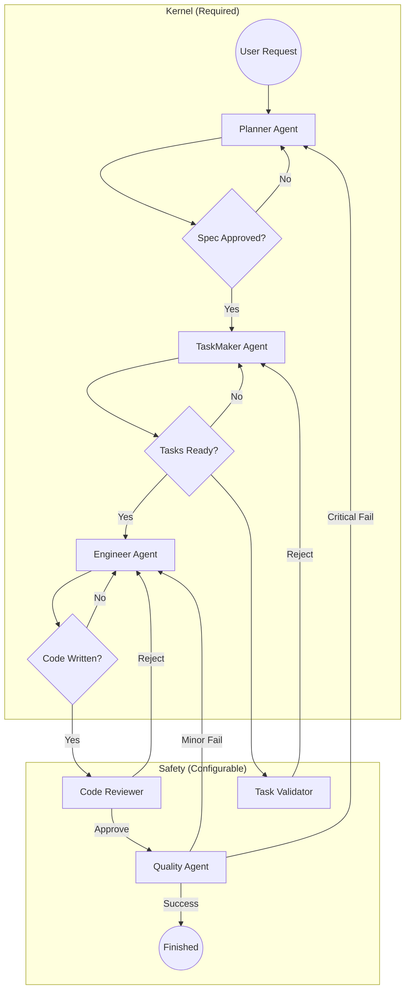

Here is the **Comprehensive Addendum A**.

This document captures **every** structural and logical change agreed upon since the last full revision. It defines the Distributed Topology, the Agent Role Abstraction, and the Circular Workflow in full detail.

---

# RFC-001: Addendum A - Distributed Architecture & Workflow Protocols

**Status:** Approved
**Scope:** Replaces Sections 2, 4, and 8 of previous revisions.
**Summary:** Moves from Monolithic Orchestration to a **Distributed 9-Processor Topology** with a **Circular "Kernel + Safety" Pipeline**.

---

## 1. Physical Topology: The 9-Processor Nervous System

**Decision:** The system is composed of 9 specialized, single-purpose state machines (Processors) connected via the Multiplexer Hub.

### 1.1 Processor Definitions & I/O Contracts

| Processor | Role | Responsibility | Input Events | Output Events |
| --- | --- | --- | --- | --- |
| **`SessionProcessor`** | **Context** | **The Librarian.** Dedicated to context loading. Scans FS, detects "Resume vs New", loads Snapshots. | `SYSTEM_START` | `CONTEXT_LOADED`, `NEW_SESSION_STARTED` |
| **`PlanningProcessor`** | **Strategy** | **The Architect.** Owns negotiation state. Drives `PlannerAgent` to generate `SPEC.md`. | `CONTEXT_LOADED` | `REQUEST_PLANNING`, `SPEC_APPROVED` |
| **`TaskingProcessor`** | **Logistics** | **The Manager.** Owns task breakdown state. Drives `TaskMaker` & `TaskValidator`. | `SPEC_APPROVED` | `REQUEST_TASK_BREAKDOWN`, `TASKS_APPROVED` |
| **`DevelopmentProcessor`** | **Execution** | **The Foreman.** Manages execution loop (`Engineer` $\leftrightarrow$ `Reviewer`). Runs `git diff` & Hotfixes. | `TASKS_APPROVED`, `HOTFIX_REQUESTED` | `REQUEST_IMPLEMENTATION`, `TASK_COMPLETED` |
| **`QualityProcessor`** | **Audit** | **The Auditor.** Manages verification. Compares `Codebase` vs `SPEC.md`. Triggers Remediation. | `FEATURE_READY` | `REQUEST_AUDIT`, `FEATURE_APPROVED` |
| **`AgentProcessor`** | **Factory** | **The Gateway.** **Only** processor allowed to call LLMs. Instantiates Agent Roles on demand. | `REQUEST_*` | `AGENT_RESPONSE`, `AGENT_FAILURE` |
| **`ToolProcessor`** | **Hands** | **I/O Execution.** Runs shell commands. Enforces "Zombie-Proof" timeouts (60s). | `REQUEST_TOOL` | `TOOL_OUTPUT`, `TOOL_FAILURE` |
| **`PersistenceProcessor`** | **Memory** | **The Ledger.** Records durable "Facts" and Type Snapshots. Filters volatile UI noise. | *Durable Events* | *None* |
| **`LoggerProcessor`** | **Voice** | **UI/UX.** Streams volatile data (tokens, progress bars) to the user. | *Volatile Events* | *UI Stream* |

---

## 2. Global System Flow (The Wiring Diagram)

**Decision:** Processors communicate strictly via the Event Hub. There are no direct function calls between processors.



---

## 3. Intelligence Layer: Agent Role Abstraction

**Decision:** Agents are **Transient, Stateless Classes**, not Processors. They are instantiated by the `AgentProcessor` only when needed.

### 3.1 The Agent Interface

```typescript
interface AgentRole {
  name: string;
  roleType: 'planner' | 'manager' | 'worker' | 'auditor';
  systemPrompt: string;
  
  // Security: Strict allowlist (e.g., Planner cannot use WriteTool)
  allowedTools: ToolDefinition[]; 
  
  // Contracts
  parse(llmResponse: string): OutputType;
}

```

### 3.2 Defined Roles & Capabilities

| Agent Role | Classification | Access Level | Output Contract |
| --- | --- | --- | --- |
| **`PlannerAgent`** | **REQUIRED** | **Read-Only** | `TechnicalSpec` (Markdown) |
| **`TaskMakerAgent`** | **REQUIRED** | **None** | `TaskList` (JSON) |
| **`EngineerAgent`** | **REQUIRED** | **Read/Write/Exec** | `CodeDiff` (Git Patch) |
| **`TaskValidatorAgent`** | *Optional* | **None** | `ValidationResult` (Pass/Fail) |
| **`ReviewerAgent`** | *Optional* | **Read-Only** | `ReviewComment` |
| **`QualityAgent`** | *Optional* | **Read/Exec** | `AuditReport` (Remediation Plan) |

---

## 4. Logical Topology: The Circular Pipeline

**Decision:** The workflow is a "Kernel + Safety" pipeline. The **Kernel** is immutable; the **Safety** layer is configurable.

### 4.1 The "Food Chain" Workflow



### 4.2 Remediation Loops

1. **Hotfix Loop (Minor Defect):** `Quality` $\to$ `Development` (Engineer) $\to$ `Quality`. *Bypasses Planning.*
2. **Remediation Loop (Critical Defect):** `Quality` $\to$ `Planning` (Re-Spec) $\to$ `Tasking` $\to$ `Development`. *Full Cycle.*

---

## 5. Control & Safety Protocols

### 5.1 Tunable Autonomy (Confidence Score)

**Decision:** A `confidence` setting (0-10) controls **User Interruption**. It **never** bypasses System Gates (Tests/Linters).

* **0-3 (Micromanage):** Agents ask permission for every action.
* **4-7 (Standard):** Agents auto-approve minor actions; pause for major gates.
* **8-10 (Autonomous):** Agents run until they hit a System Error.

### 5.2 Hallucination Management (Quarantine)

**Decision:**

1. **Tracking:** Track `hallucinations` (claims vs `git diff` mismatch).
2. **Quarantine:** Kill session if threshold exceeded.
3. **Tombstones:** Inject a synthetic `SYSTEM_WARNING` event into the *next* agent's context (e.g., "Previous attempt failed due to hallucinated path") to prevent regression.

### 5.3 Zombie-Proofing

**Decision:**

1. **Dead Man's Switch:** Hard 60s timeout on all tools.
2. **Input Seal:** `stdin` is closed. Interactive tools fail fast (crash) instead of hanging.
3. **Atomic Commits:** Partial/interrupted agent output is discarded. Only valid, parsed output is committed to the Ledger.

### 5.4 Scope Resolution

**Decision:** Config scopes (e.g., `"hotfix"`, `"feature"`) are resolved by:

1. **Explicit:** `scope: "hotfix"` in Spec/Plan.
2. **Automatic:** `DevelopmentProcessor` matches modified files against glob patterns in config.
3. **Fallback:** Default scope.
