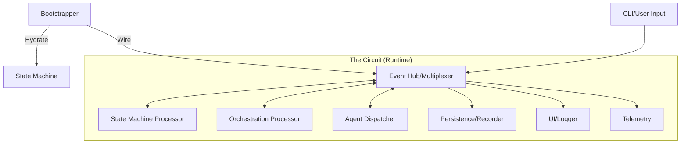
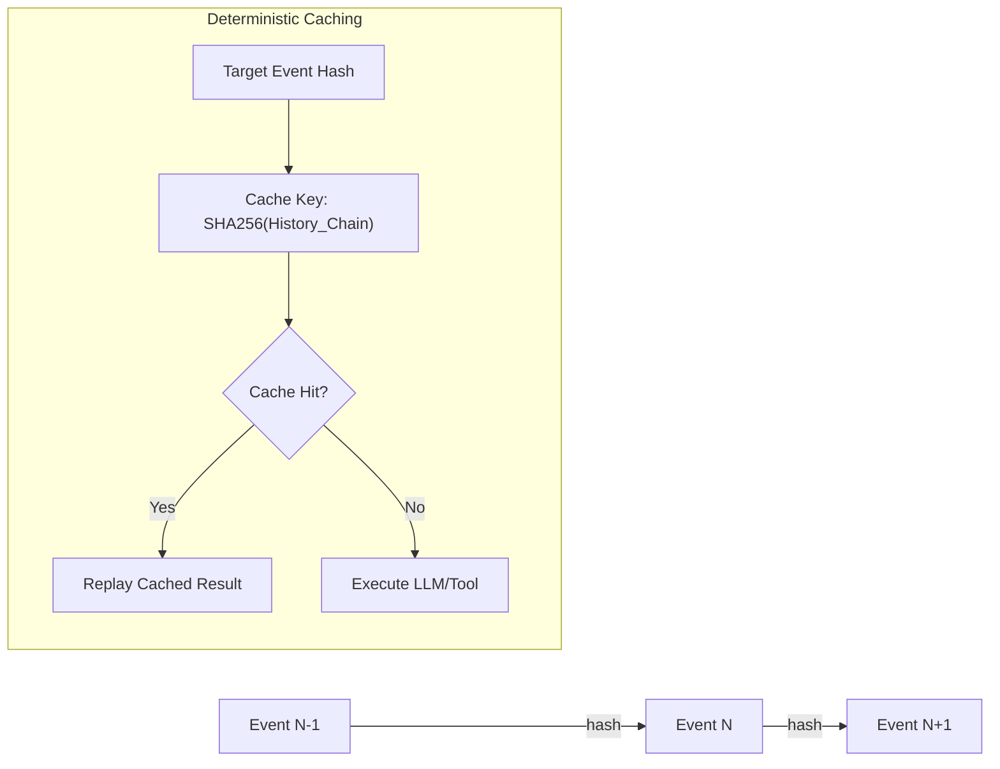
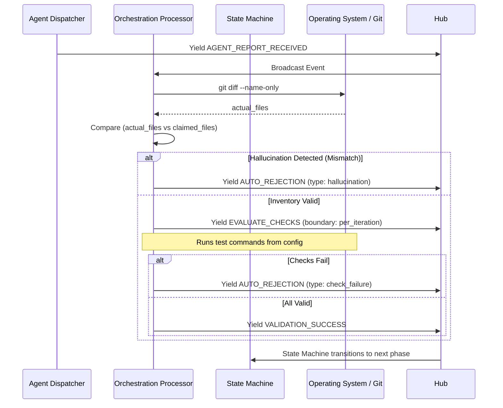

# Request for Comments: Ductus v2 Architecture (Event-Sourced Multiplexer)

## 1. Executive Summary
Ductus currently operates on an imperative, hardcoded, single-shot execution model. While effective for simple transformations, this architecture severely limits complex orchestration, session-based reasoning, and deep observability.

Ductus v2 is a complete foundational rewrite. It adopts **Event Sourcing**, a pure **State Machine (XState)**, and a **Reactive Stream Processor (Multiplexer)** architecture. It introduces a rigorous Zero-Trust Orchestration pipeline, Proof-of-Work cryptographic event ledgers, and decoupled Agent topologies.

---

## 2. System Overview & Core Principles

### 2.1 The Philosophy
- **Immutable Ledger (Blockchain Model):** Every occurrence in the system is an immutable event stamped with an author ID, a sequence number, and a cryptographic hash. The system state is a pure mathematical projection of this ledger.
- **Circuit Multiplexing:** Events flow concurrently to all observers (Stream Processors) via a central Hub.
- **Zero-Trust Orchestration:** Agent assertions are never assumed correct. An isolated `OrchestrationProcessor` validates all claims against the OS/Git and triggers automated rejections.

### 2.2 Global System Flow


---

## 3. The Event Ledger & Cryptographic Integrity

### 3.1 Event Structure
To guarantee determinism, timestamp collision avoidance, tamper-evidence, and verifiable caching, the ledger utilizes strict "Proof of Work" chaining.

```typescript
export interface DuctusEvent<T = unknown> {
  eventId: string;           // UUID/ULID
  type: string;              // e.g., 'WORKFLOW_STARTED', 'AGENT_REPORT'
  authorId: string;          // Identifier of the producing node/agent
  timestamp: number;         // Wall clock time
  sequenceNumber: number;    // Monotonically increasing absolute order (Assigned by Hub)
  prevHash: string;          // Hash of the immediately preceding event
  hash: string;              // SHA-256( prevHash + authorId + sequenceNumber + JSON.stringify(payload) )
  payload: T;                // Data specific to event type
}
```

### 3.2 Verification and Caching Logic


---

## 4. The "Brain": State Machine (XState)
The `StateMachine` is a pure, synchronous `StreamProcessor`. 

**Decision:** It performs zero I/O. It applies factual events to its internal context and yields **Effects**.

### 4.1 State Hierarchy
The machine is hierarchical to handle parallelism and task isolation:
1.  **Orchestrator Level:** Manages Plan -> Execution -> Success/Failure.
2.  **Task Level (Spawned):** Managed individual task status (In-Progress, Under-Review, Remediating).
3.  **Agent Level:** Tracks session health, rejections, and hallucination counts.

---

## 5. The "Bouncer": OrchestrationProcessor
This is the most critical logic layer for reliability. It stands between the Agent and the State Machine.

### 5.1 Verification Loop Flowchart


### 5.2 Check Boundaries
Checks are defined with specific execution lifecycles in `ductus.config.ts`:

| Boundary | Trigger | Example Check |
| :--- | :--- | :--- |
| `per_iteration` | Every agent sub-submission | Linter, Prettier |
| `per_task` | Agent marks task done | Unit tests, Type-check |
| `per_feature` | Plan completed | Integration tests, E2E |

**Context Injection:** Commands use Handlebars-style syntax: `jest {{files}}`. The Orchestrator parses the `git diff` output and interpolates the space-separated list of modified files into the command string.

---

## 6. Hallucination Management & Session Poisoning

Agent sessions are prone to "apology loops" and context-window degradation.

**Decision:** The system strictly manages **Max Rejections** and **Max Recognizable Hallucinations**.

### 6.1 Session Replacement Logic
- If `hallucinationCount >= config.maxRecognizedHallucinations`:
    1.  Yield `HALLUCINATION_DETECTED` event (marks subsequent event author as poisoned).
    2.  Yield `KILL_AGENT` effect to terminate the session.
    3.  Yield `PROMPT_AGENT` (for a fresh session).
- **History Synthesis:** When building the prompt for the *new* session, the `AgentDispatcher` scans the ledger. It ignores every event authored by a "Poisoned Agent ID" (those following a `HALLUCINATION_DETECTED` mark).

---

## 7. The "Muscle": Agent Dispatcher & Adapters

### 7.1 Dispatcher Strategy Pattern
The Dispatcher manages an ordered list of fallback strategies per role:
```typescript
interface AgentStrategy {
  model: string;
  template: string; // Path to .mx file
  maxRetries: number;
}
```

### 7.2 The Adapter Interface
```typescript
interface AgentAdapter {
  // Streaming output for real-time Hub broadcasting
  execute(prompt: string, history: AgentMessage[], signal: AbortSignal): AsyncIterable<string>;
  terminate(): Promise<void>;
}
```

---

## 8. Bootstrapping & Crash Recovery

Recovery is the responsibility of the `Bootstrapper`, a high-level entity above the circuit.

**Recovery Algorithm:**
1.  **Hydrate:** Load the latest `Snapshot` (contains sequence number `N`).
2.  **Replay:** Query Ledger for events `sequence > N`.
3.  **Silent Mode:** Circuit enters `ReplayMode`. Dispatchers are muted.
4.  **Pump:** Events are pumped into the State Machine to restore the logic tree.
5.  **Ignite:** ReplayMode ends. Circuit is live.

---

## 9. Configuration Manifest (`ductus.config.ts`)
```typescript
export default {
  checks: {
    "lint": { command: "npm run lint", boundary: "per_iteration" },
    "test:unit": { command: "jest {{files}}", boundary: "per_task", requires_context: true }
  },
  roles: {
    "engineer": {
      lifecycle: "session",
      maxRecognizedHallucinations: 2,
      strategies: [
        { model: "claude-3.5-sonnet", template: "./prompts.md/eng-anthropic.mx", maxRetries: 3 },
        { model: "gpt-4o", template: "./prompts.md/eng-openai.mx", maxRetries: 1 }
      ]
    }
  }
}
```
