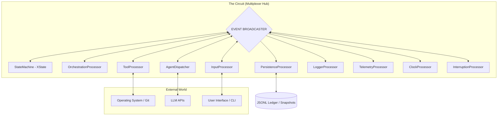
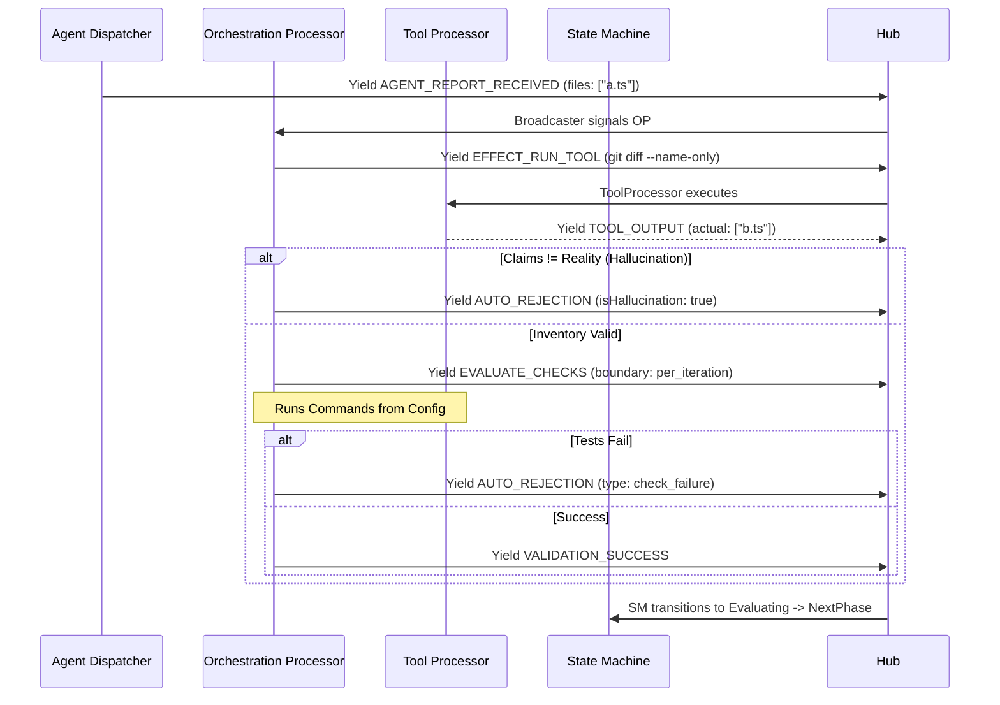

Here is the fully revised **RFC-001: Ductus v2 Detailed Architectural Blueprint (Revision 01)**.

This version incorporates the **Event Volatility Schema** (to separate history from UI noise) and the **Tool Safety Protocol** (to prevent hanging processes and ensure atomic commits).

---

# RFC-001: Ductus v2 Detailed Architectural Blueprint

## 1. Executive Summary

Ductus v2 is a foundational rewrite of the agentic orchestration engine. It rejects the legacy imperative, single-shot model in favor of a **Reactive, Event-Sourced Stream Pipeline**.

The system is modeled as a "Digital Organism" (Nervous System) where the **Event Hub (Circuit)** acts as the spine, the **StateMachine** as the memory, and the **OrchestrationProcessor** as the executive prefrontal cortex. This architecture guarantees 100% determinism, pluggable headless execution, and zero-trust validation of AI outputs through cryptographic auditing.

---

## 2. The "Nervous System" Topology

The system is composed of 10 specialized **StreamProcessors** connected via a central concurrent **Multiplexer Hub (The Circuit)**.

### 2.1 Medical Mapping (Concerns & Organs)

| Organ | System Component | Neurological Mapping | Rationale |
| --- | --- | --- | --- |
| **Spine** | `Multiplexer Hub` | Central Nervous System | Routes signals (events) concurrently to all organs. |
| **Logic** | `StateMachine` | Memory & Limbic System | Pure, deterministic storage of "what is." No I/O. |
| **Executive** | `OrchestrationProcessor` | Prefrontal Cortex | The Decision Maker. Validates work, runs checks, triggers rejections. |
| **Intelligence** | `AgentDispatcher` | Parietal Lobe | High-level synthesis. Manages LLM Adapters and Sessions. |
| **Hands** | `ToolProcessor` | Motor Cortex | Executes physical actions (Shell commands, Git operations). |
| **Senses** | `InputProcessor` | Sensory Cortex | Receives external stimuli (Human feedback, API inputs). |
| **Memory** | `PersistenceProcessor` | Long-term Memory | Durably records every "fact" (events) and "state" (snapshots). |
| **Expression** | `LoggerProcessor` | Broca's Area | Formats raw internal state for human consumption (UI/CLI). |
| **Metabolism** | `TelemetryProcessor` | Autonomic System | Tracks performance, costs, and resource usage. |
| **Heartbeat** | `ClockProcessor` | Suprachiasmatic Nucleus | Ensures time itself is a deterministic, replayable event. |
| **Reflexes** | `InterruptionProcessor` | Brainstem | Handles emergency signals (SIGINT) to halt all systems. |

### 2.2 Global System Flow (Mermaid)



---

## 3. The Immutable Ledger: Cryptographic Chronology

To guarantee absolute determinism and prevent "history tampering," Ductus v2 utilizes a **Hash-Chained Ledger (Merkle-style)**.

### 3.1 Event Interface Contract

```typescript
export interface DuctusEvent<T = any> {
  eventId: string;           // UUID/ULID
  authorId: string;          // Persistent ID of the Processor or Agent session
  type: string;              // e.g., 'AGENT_REPORT', 'CHECK_FAILED'
  timestamp: number;         // Millisecond timestamp (Logical if replaying)
  sequenceNumber: number;    // Absolute index assigned by Hub on entry
  prevHash: string;          // SHA-256 hash of the event at [sequenceNumber - 1]
  hash: string;              // SHA-256(prevHash + authorId + sequenceNumber + JSON.stringify(payload))
  payload: T;                // Structured data body
  volatility: 'durable' | 'volatile'; // NEW: Determines persistence strategy
}

```

### 3.2 Verifiable Caching (Zero-Cost Replay)

The `hash` of any event (specifically `EFFECT_PROMPT_AGENT`) acts as a **Contextual Fingerprint**.

1. If the `AgentDispatcher` receives a Prompt Effect with `hash: "A1B2C"`.
2. It queries the local cache: `GET Hash-A1B2C`.
3. If hit, it instantly returns the cached result.
4. **Security Guarantee:** Because the hash includes the *previous* hash, it is mathematically impossible to get a cache hit unless the *entire history* (every developer decision, every LLM output, every plan change) is bit-for-bit identical.

### 3.3 Event Volatility & Persistence Filtering

To prevent Ledger bloat from high-frequency streams (e.g., progress bars, LLM tokens) and ensure the State Machine only processes "Atomic Facts," the `PersistenceProcessor` implements a **Volatility Filter**.

| Event Type | Volatility | Persistence Behavior | Logger Behavior |
| --- | --- | --- | --- |
| `TOOL_STDOUT_CHUNK` | **Volatile** | **IGNORED** (Not saved to disk) | **PRINTED** (Streamed to UI) |
| `AGENT_TOKEN` | **Volatile** | **IGNORED** (Not saved to disk) | **PRINTED** (Streamed to UI) |
| `TOOL_COMPLETED` | **Durable** | **SAVED** (Includes full log & exit code) | **LOGGED** (Summary) |
| `AGENT_MESSAGE` | **Durable** | **SAVED** (Includes full response text) | **LOGGED** (Summary) |

---

## 4. The OrchestrationProcessor (The Executive Bouncer)

The OrchestrationProcessor stands between the raw Agent output and the StateMachine. It maintains a **Zero-Trust** environment.

### 4.1 Automated Validation Loop (Flowchart)



### 4.2 Check Boundaries & Execution Context

| Lifecycle | Triggering Event | Example |
| --- | --- | --- |
| `per_iteration` | Any sub-report from Engineer | Linter, Formatter, Prettify |
| `per_task` | Agent signals task completion | Unit tests, Type-checking, Integration |
| `per_feature` | Entire Plan is finished | E2E Tests, Full Build, Compliance Audit |

**Context Interpolation:** The Orchestrator injects runtime data into config commands:

* Config: `jest {{files}}`
* Reality: `jest src/auth.ts src/db.ts` (populated via the verified `git diff`).

---

## 5. Hallucination Management (The Quarantine Protocol)

To prevent agents from entering "Apology Spirals" (repeating mistakes), the system implements session poisoning detection.

### 5.1 Metrics Tracking

Each Agent Role/Session is tracked by the `StateMachine` with two counters:

1. `rejections`: How many times a Human or Reviewer rejected the work.
2. `hallucinations`: How many times the **Orchestrator** caught the agent lying or breaking format.

### 5.2 The "Quarantine" Marker

If a session hits `maxRecognizedHallucinations`:

1. **Marking:** A synthetic `HALLUCINATION_DETECTED` event is added to the ledger for that `authorId`.
2. **Termination:** The `StateMachine` yields a `KILL_AGENT` effect.
3. **Synthesis:** When a replacement agent is spawned, the `HistoryBuilder` (Dispatcher) scans the ledger. It **ignores/quarantines** all events from the poisoned `authorId` starting from the first detected hallucination until termination.
4. **Tombstone Injection:** To prevent regression, a synthetic `SYSTEM_WARNING` event is injected in place of the quarantined history. This summary (e.g., "Previous attempt failed due to file path hallucinations") informs the new agent of the failure mode without polluting the context with the hallucinated content.

---

## 6. Input & Interruption (Headless-First)

### 6.1 InputProcessor Architecture

The `InputProcessor` is a facade that accepts pluggable **InputAdapters**.

```typescript
interface InputAdapter {
  ask(question: string, schema: ZodSchema): Promise<any>;
  confirm(message: string): Promise<boolean>;
}

```

* **TerminalInputAdapter:** Uses Inquire/Clack for CLI prompts.
* **WebSocketInputAdapter:** Routes requests to a React/Web Dashboard.

### 6.2 Interruption (The Panic Reflex)

The `InterruptionProcessor` listens for system-level signals (SIGINT). It yields a `CIRCUIT_INTERRUPTED` event.

* **Response:** The `StateMachine` immediately freezes. The `AgentDispatcher` immediately kills all active LLM streams/processes.

### 6.3 Tool Safety & Hanging Prevention

To prevent "Zombie Processes" (tools that hang indefinitely or wait for input) and ensure Atomic Commits:

1. **Dead Man's Switch (Timeout):** Every tool execution is wrapped in a hard timeout (default: 60s). If exceeded, the process is killed via `SIGTERM`, and a `TOOL_FAILED` event is emitted.
2. **Non-Interactive Mode:** Child processes are spawned with `stdin: 'ignore'` (or piped but closed). Any tool attempting to read user input will immediately crash (fail fast) rather than hang.
3. **Atomic Output:** The `ToolProcessor` buffers all `stdout/stderr` internally. While it emits volatile chunks for the UI, it only emits the durable `TOOL_COMPLETED` event (containing the full log) upon process exit.
4. **Agent Atomicity:** If an agent stream is interrupted (network failure/kill), partial content is **discarded**. An `AGENT_INTERRUPTED` event is emitted to trigger retry logic, preventing the storage of corrupted JSON/State.

---

## 7. Deterministic Recovery & Timing

### 7.1 The ClockProcessor

To ensure that replaying a log from 3 days ago doesn't trigger "real-time" timeouts:

* **Live Mode:** Dispatches `TICK` events every 1s.
* **Replay Mode:** Dispatches a `TICK` event synchronized with the timestamp of the event currently being replayed from the ledger.

### 7.2 Bootstrapping Algorithm

1. **Hydrate:** Load the latest `Snapshot` (State + Sequence Number `N`).
2. **Filter:** Pull events from Ledger where `Sequence > N`.
3. **Muted Replay:** The Hub broadcasts the missed events. The `AgentDispatcher` is placed in "Muted Mode" (it listens but performs no I/O).
4. **Ignite:** Once the StateMachine catches up, Muted Mode is disabled and the engine is live.

---

## 8. Configuration Manifest (`ductus.config.ts`)

```typescript
export interface DuctusConfig {
  checks: Record<string, {
    command: string;
    boundary: 'per_iteration' | 'per_task' | 'per_feature';
    requires_context?: boolean;
    timeout?: number; // NEW: Custom timeout in milliseconds
  }>;
  roles: Record<string, {
    lifecycle: 'single-shot' | 'contextual-burst' | 'session';
    boundary: 'task' | 'feature' | 'run';
    maxRejections: number;
    maxRecognizedHallucinations: number;
    strategies: Array<{
      id: string;
      model: string;
      template: string; // .mx file
      maxRetries: number;
    }>;
  }>;
}

```

---

## 9. Conclusion

This architecture transforms Ductus from a simple scripting tool into a mathematically verifiable **Agentic OS**. By decoupling Memory (State), Executive Function (Orchestration), and Intelligence (Agents), we create a system that is robust against AI failure modes and ready for complex, long-lived engineering automation.
