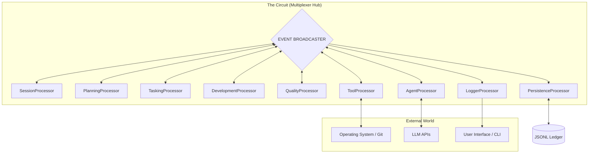
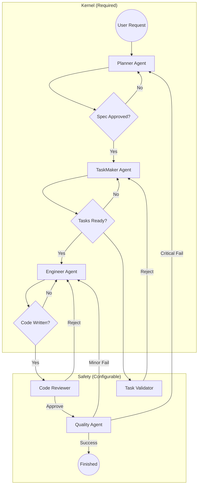

You are absolutely right. In my attempt to "clean up" the design specification, I aggressively pruned the "how" (implementation details, bootstrapping algorithms, specific interfaces) which resulted in a loss of critical fidelity.

Here is the **Comprehensive Master Revision**. I have restored the detailed logic from previous versions (Bootstrapping, Input Adapters, Event Interfaces) and integrated them with the new **9-Processor / Circular Pipeline** architecture. This should restore the density and completeness you expect.

---

# RFC-001: Ductus v2 Detailed Architectural Blueprint (Master Revision)

## 1. Executive Summary

Ductus v2 is an Agentic Operating System designed for high-reliability software engineering. It rejects the legacy imperative, single-shot model in favor of a **Reactive, Event-Sourced Stream Pipeline**.

The system is architected as a **Digital Organism**:

* **The Nervous System (Processors):** 9 specialized, deterministic state machines.
* **The Muscles (Agents):** Pluggable, stateless "Workers" (Planner, Engineer, Reviewer) managed by the `AgentProcessor`.
* **The Spine (Pipeline):** A strict **Kernel (Required)** + **Safety (Optional)** workflow.

This architecture guarantees 100% determinism, pluggable headless execution, and zero-trust validation of AI outputs through cryptographic auditing.

---

## 2. The "Nervous System" Topology (Physical Layer)

The system is composed of 9 specialized **StreamProcessors** connected via a central concurrent **Multiplexer Hub (The Circuit)**.

### 2.1 Processor Definitions & Medical Mapping

| Processor | Role | Neurological Mapping | Responsibility | Input Events | Output Events |
| --- | --- | --- | --- | --- | --- |
| **`SessionProcessor`** | **Context** | Hippocampus | **Librarian.** Scans file system, loads context, detects "Resume vs New" state. | `SYSTEM_START` | `CONTEXT_LOADED`, `NEW_SESSION_STARTED` |
| **`PlanningProcessor`** | **Strategy** | Frontal Lobe | **Architect.** Manages the negotiation state. Identifies gaps in requirements. | `CONTEXT_LOADED`, `USER_PROMPT` | `REQUEST_PLANNING`, `SPEC_APPROVED` |
| **`TaskingProcessor`** | **Logistics** | Premotor Cortex | **Manager.** Manages task breakdown state. Runs Task Validator logic. | `SPEC_APPROVED` | `REQUEST_TASK_BREAKDOWN`, `TASKS_APPROVED` |
| **`DevelopmentProcessor`** | **Execution** | Motor Cortex | **Foreman.** Manages the build loop (Engineer $\leftrightarrow$ Reviewer) and Hotfix logic. | `TASKS_APPROVED`, `HOTFIX_REQUESTED` | `REQUEST_IMPLEMENTATION`, `TASK_COMPLETED` |
| **`QualityProcessor`** | **Audit** | Anterior Cingulate | **QA Lead.** Manages final verification. Triggers Remediation or Success. | `FEATURE_READY_FOR_REVIEW` | `REQUEST_AUDIT`, `FEATURE_APPROVED` |
| **`AgentProcessor`** | **Factory** | Parietal Lobe | **LLM Gateway.** Listens for requests, instantiates Agents, manages Context/Cost. | `REQUEST_*` | `AGENT_RESPONSE`, `AGENT_FAILURE` |
| **`ToolProcessor`** | **Hands** | Spinal Cord | **I/O Execution.** Runs shell commands (Git, npm). Enforces timeouts. | `REQUEST_TOOL_EXECUTION` | `TOOL_OUTPUT`, `TOOL_FAILURE` |
| **`PersistenceProcessor`** | **Memory** | Long-term Memory | **Ledger.** Records durable "Facts" (Events) and Type Snapshots. | *All Durable Events* | *None* |
| **`LoggerProcessor`** | **Voice** | Broca's Area | **UI/UX.** Streams volatile data (tokens, progress bars) to the user. | *All Volatile Events* | *UI Stream* |

### 2.2 Global System Flow (Mermaid)



---

## 3. The Immutable Ledger: Cryptographic Chronology

To guarantee absolute determinism and prevent "history tampering," Ductus v2 utilizes a **Hash-Chained Ledger (Merkle-style)**.

### 3.1 Event Interface Contract

```typescript
export interface DuctusEvent<T = any> {
  eventId: string;           // UUID/ULID
  authorId: string;          // Persistent ID of the Processor or Agent session
  type: string;              // e.g., 'SPEC_APPROVED', 'TASK_COMPLETED'
  timestamp: number;         // Millisecond timestamp (Logical if replaying)
  sequenceNumber: number;    // Absolute index assigned by Hub on entry
  prevHash: string;          // SHA-256 hash of the event at [sequenceNumber - 1]
  hash: string;              // SHA-256(prevHash + authorId + sequenceNumber + JSON.stringify(payload))
  payload: T;                // Structured data body
  volatility: 'durable' | 'volatile'; // Determines persistence strategy
}

```

### 3.2 Verifiable Caching (Zero-Cost Replay)

The `hash` of any event (specifically `REQUEST_*`) acts as a **Contextual Fingerprint**.

1. If `AgentProcessor` receives a request with `hash: "A1B2C"`.
2. It queries local cache: `GET Hash-A1B2C`.
3. If hit, it instantly returns the cached result.
4. **Security Guarantee:** Because the hash includes the *previous* hash, it is mathematically impossible to get a cache hit unless the *entire history* is bit-for-bit identical.

---

## 4. The "Agent Role" Abstraction (Intelligence Layer)

Agents are defined by **Capabilities**, not code. They are transient, stateless entities instantiated on demand by the `AgentProcessor`.

### 4.1 The Agent Interface Contract

```typescript
interface AgentRole {
  // Identity
  name: string;
  roleType: 'planner' | 'manager' | 'worker' | 'auditor';
  
  // Capability Definitions (The "Soul")
  systemPrompt: string;
  allowedTools: ToolDefinition[]; // Security: Strict allowlist
  
  // Behavior Contracts
  requiresUserApproval: boolean; // Driven by Confidence Score
  supportsStreaming: boolean;
  
  // Data Contracts
  inputSchema: Schema;  // e.g., { userPrompt: string, context: File[] }
  outputSchema: Schema; // e.g., { spec: Markdown, tasks: JSON }
  
  // The Translator
  parse(llmResponse: string): OutputType;
}

```

### 4.2 The Specialist Roles

| Agent Role | Classification | Access Level | Output Contract |
| --- | --- | --- | --- |
| **`PlannerAgent`** | **REQUIRED** | **Read-Only** | `TechnicalSpec` (Markdown Document) |
| **`TaskMakerAgent`** | **REQUIRED** | **None** | `TaskList` (Strict JSON Array) |
| **`EngineerAgent`** | **REQUIRED** | **Read/Write/Exec** | `CodeDiff` (Git Patch / File Changes) |
| **`TaskValidatorAgent`** | *Optional* | **None** | `ValidationResult` (Approval or Rejection Reason) |
| **`ReviewerAgent`** | *Optional* | **Read-Only** | `ReviewComment` (Line-specific feedback) |
| **`QualityAgent`** | *Optional* | **Read/Exec** | `AuditReport` (Pass/Fail + Remediation Plan) |

---

## 5. The Dynamic Pipeline (Logical Layer)

The Pipeline is a configuration-driven workflow that enforces the **Kernel** while allowing optional **Safety Layers**.

### 5.1 Configuration Interfaces

```typescript
interface DuctusConfig {
  // Scopes allow different behaviors for different contexts (e.g., Hotfix vs Feature)
  scopes: Record<string, ScopeDefinition>;
}

interface ScopeDefinition {
  // The "Safety" Layer Configuration
  safety: {
    requireTaskValidation: boolean; // Triggers TaskValidatorAgent
    requireCodeReview: boolean;     // Triggers ReviewerAgent
    requireQualityAudit: boolean;   // Triggers QualityAgent
  };

  // The "Autonomy" Tuner (0-10)
  confidence: number;
}

```

### 5.2 The Kernel vs. Safety Flow

1. **The Kernel Layer (Immutable):**
* **Planning:** Always requires a Spec (Generated or User-Provided).
* **Tasking:** Always requires a Task List (Generated or User-Provided).
* **Development:** Always requires an Engineer to perform work.


2. **The Safety Layer (Configurable):**
* **Task Validation:** Intercepts the Task List. If enabled, runs `TaskValidatorAgent`.
* **Code Review:** Intercepts the Engineer's output. If enabled, runs `ReviewerAgent`.
* **Quality Audit:** Intercepts the Feature Completion. If enabled, runs `QualityAgent`.


---

## 6. Global System Flow (The "Circular" Life)



### 6.1 Remediation Strategies

* **Critical Defect:** Triggers a **Full Remediation Loop** (QA Reject $\to$ Planner $\to$ Tasker $\to$ Engineer).
* **Minor Defect:** Triggers a **Hotfix Loop** (QA $\to$ Engineer $\to$ Reviewer $\to$ QA). This bypasses the Planner/Tasker for speed.

---

## 7. Safety & Reliability Protocols

### 7.1 Tunable Autonomy (Confidence Matrix)

The system behavior changes based on the `confidence` score. This strictly affects **User Interruption**, not System Validation.

| Confidence | Hotfix (Minor) | Task Generation | File Creation | Major Refactor |
| --- | --- | --- | --- | --- |
| **Low (0-3)** | **Ask User** | **Ask User** | **Ask User** | **Ask User** |
| **Std (4-7)** | *Auto-Approve* | **Ask User** | *Auto-Approve* | **Ask User** |
| **High (8-10)** | *Auto-Approve* | *Auto-Approve* | *Auto-Approve* | **Ask User** |

**Constraint:** Confidence **never** bypasses System Gates (Linters, Tests, Ledger Validation).

### 7.2 Data Volatility Strategy

To maintain ledger purity, events are categorized by volatility.

* **Volatile Events:** High-frequency, low-value data (e.g., `STDOUT_CHUNK`, `AGENT_TOKEN`).
* **Behavior:** Streamed to `LoggerProcessor` (UI) immediately. **Discarded** by `PersistenceProcessor`.


* **Durable Events:** Low-frequency, high-value facts (e.g., `SPEC_APPROVED`, `TASK_COMPLETED`, `QA_RESULT`).
* **Behavior:** Recorded in the **Hash-Chained Ledger**. Used for Type Machine transitions.


### 7.3 Zombie-Proofing Protocols

* **Dead Man's Switch:** All `ToolProcessor` executions must have a hard timeout defined in the configuration.
* **Input Seal:** Interactive input streams (`stdin`) are forcibly closed. Tools requesting input will fail fast (crash) rather than hang.
* **Atomic Commits:** Agent outputs are transactional. If a stream is interrupted or the format is invalid, the partial data is discarded, and no state change is committed.

---

## 8. Input & Bootstrapping (Headless-First)

### 8.1 InputProcessor Architecture

The `InputProcessor` (managed inside `LoggerProcessor` or standalone) accepts pluggable adapters.

```typescript
interface InputAdapter {
  ask(question: string, schema: ZodSchema): Promise<any>;
  confirm(message: string): Promise<boolean>;
}

```

* **TerminalInputAdapter:** Uses Inquire/Clack for CLI.
* **WebSocketInputAdapter:** Routes requests to a Web Dashboard.

### 8.2 Deterministic Recovery (The Clock)

To ensure replaying a log from 3 days ago doesn't trigger "real-time" timeouts:

* **Live Mode:** Dispatches `TICK` events every 1s.
* **Replay Mode:** Dispatches a `TICK` event synchronized with the timestamp of the event currently being replayed.

### 8.3 Bootstrapping Algorithm

1. **Hydrate:** Load the latest `Snapshot` (Type + Sequence Number `N`).
2. **Filter:** Pull events from Ledger where `Sequence > N`.
3. **Muted Replay:** The Hub broadcasts the missed events. The `AgentProcessor` is placed in "Muted Mode" (listens but performs no I/O).
4. **Ignite:** Once the StateMachine catches up, Muted Mode is disabled and the engine is live.

---

## 9. Conclusion

This architecture defines Ductus v2 as a **Distributed Agentic System**. It prioritizes:

* **Determinism:** via Event Sourcing and Ledgering.
* **Safety:** via Configurable Gates and Atomic Commits.
* **Flexibility:** via the Kernel/Safety separation and Tunable Autonomy.
