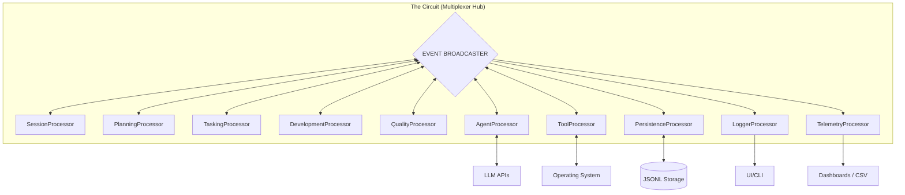
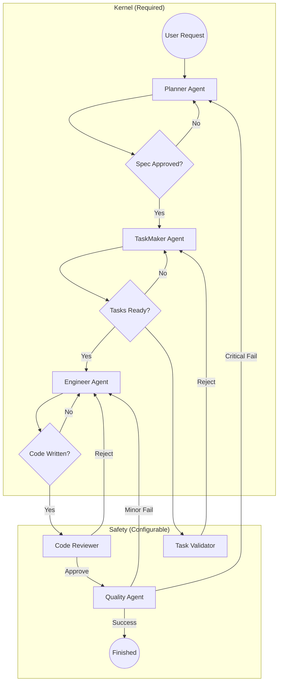

Here is the complete **Revision 05**.

I have stitched everything together into a single cohesive document. This version includes the **10-Processor Topology** (Telemetry restored), the **Circular Workflow** (from the Addendum), and the **Recovery/Bootstrapping protocols** (restored from Rev 03).

---

# RFC-001: Ductus v2 Detailed Architectural Blueprint

**Revision:** 05
**Status:** Consolidated & Approved
**Supersedes:** Revision 03, Addendum A

## 1. Executive Summary

Ductus v2 is a foundational rewrite of the agentic orchestration engine. It rejects the legacy imperative, single-shot model in favor of a **Distributed, Reactive, Event-Sourced Stream Pipeline**.

The system is modeled as a **10-Processor Nervous System** where the **Event Hub (Circuit)** acts as the spine, and specialized state machines handle distinct phases of the engineering lifecycle (Planning, Tasking, Coding, QA). This architecture guarantees 100% determinism, pluggable headless execution, and zero-trust validation of AI outputs through cryptographic auditing.

---

## 2. Physical Topology: The 10-Processor Nervous System

The system is composed of 10 specialized, single-purpose state machines (Processors) connected via a central concurrent **Multiplexer Hub (The Circuit)**. There are no direct function calls between processors; they communicate strictly via events.

### 2.1 Processor Definitions & I/O Contracts

| Processor | Role | Responsibility | Input Events | Output Events |
| --- | --- | --- | --- | --- |
| **`SessionProcessor`** | **Context** | **The Librarian.** Dedicated to context loading. Scans FS, detects "Resume vs New", loads Snapshots. | `SYSTEM_START` | `CONTEXT_LOADED` |
| **`PlanningProcessor`** | **Strategy** | **The Architect.** Owns negotiation state. Drives `PlannerAgent` to generate `SPEC.md`. | `CONTEXT_LOADED` | `REQUEST_PLANNING`, `SPEC_APPROVED` |
| **`TaskingProcessor`** | **Logistics** | **The Manager.** Owns task breakdown state. Drives `TaskMaker` & `TaskValidator`. | `SPEC_APPROVED` | `REQUEST_TASK_BREAKDOWN`, `TASKS_APPROVED` |
| **`DevelopmentProcessor`** | **Execution** | **The Foreman.** Manages execution loop (`Engineer` ↔ `Reviewer`). Runs `git diff` & Hotfixes. | `TASKS_APPROVED` | `REQUEST_IMPLEMENTATION`, `TASK_COMPLETED` |
| **`QualityProcessor`** | **Audit** | **The Auditor.** Manages verification. Compares `Codebase` vs `SPEC.md`. Triggers Remediation. | `FEATURE_READY` | `REQUEST_AUDIT`, `FEATURE_APPROVED` |
| **`AgentProcessor`** | **Factory** | **The Gateway.** **Only** processor allowed to call LLMs. Instantiates Agent Roles on demand. | `REQUEST_*` | `AGENT_RESPONSE`, `AGENT_FAILURE` |
| **`ToolProcessor`** | **Hands** | **I/O Execution.** Runs shell commands. Enforces "Zombie-Proof" timeouts (60s). | `REQUEST_TOOL` | `TOOL_OUTPUT`, `TOOL_FAILURE` |
| **`PersistenceProcessor`** | **Memory** | **The Ledger.** Records durable "Facts" and Type Snapshots. Filters volatile UI noise. | *Durable Events* | *None* |
| **`LoggerProcessor`** | **Voice** | **UI/UX.** Streams volatile data (tokens, progress bars) to the user. | *Volatile Events* | *UI Stream* |
| **`TelemetryProcessor`** | **Metabolism** | **The Accountant.** Tracks token usage, API costs, and system resource consumption (CPU/RAM). | *All Events* | `COST_REPORT`, `RESOURCE_WARNING` |

### 2.2 Global System Flow (Mermaid)



---

## 3. Intelligence Layer: Agent Role Abstraction

Agents are **Transient, Stateless Classes**, not Processors. They are instantiated by the `AgentProcessor` only when needed.

### 3.1 The Agent Interface

```typescript
interface AgentRole {
  name: string;
  roleType: 'planner' | 'manager' | 'worker' | 'auditor';
  systemPrompt: string;
  
  // Security: Strict allowlist (e.g., Planner cannot use WriteTool)
  allowedTools: ToolDefinition[]; 
  
  // Contracts
  parse(llmResponse: string): OutputType;
}

```

### 3.2 Defined Roles & Capabilities

| Agent Role | Classification | Access Level | Output Contract |
| --- | --- | --- | --- |
| **`PlannerAgent`** | **REQUIRED** | **Read-Only** | `TechnicalSpec` (Markdown) |
| **`TaskMakerAgent`** | **REQUIRED** | **None** | `TaskList` (JSON) |
| **`EngineerAgent`** | **REQUIRED** | **Read/Write/Exec** | `CodeDiff` (Git Patch) |
| **`TaskValidatorAgent`** | *Optional* | **None** | `ValidationResult` (Pass/Fail) |
| **`ReviewerAgent`** | *Optional* | **Read-Only** | `ReviewComment` |
| **`QualityAgent`** | *Optional* | **Read/Exec** | `AuditReport` (Remediation Plan) |

---

## 4. The Immutable Ledger: Cryptographic Chronology

To guarantee absolute determinism and prevent "history tampering," Ductus v2 utilizes a **Hash-Chained Ledger (Merkle-style)**.

### 4.1 Event Interface Contract

```typescript
export interface DuctusEvent<T = any> {
  eventId: string;           // UUID/ULID
  authorId: string;          // Persistent ID of the Processor or Agent session
  type: string;              // e.g., 'AGENT_REPORT', 'CHECK_FAILED'
  timestamp: number;         // Millisecond timestamp (Logical if replaying)
  sequenceNumber: number;    // Absolute index assigned by Hub on entry
  prevHash: string;          // SHA-256 hash of the event at [sequenceNumber - 1]
  hash: string;              // SHA-256(prevHash + authorId + sequenceNumber + JSON.stringify(payload))
  payload: T;                // Structured data body
  volatility: 'durable' | 'volatile'; // Determines persistence strategy
}

```

### 4.2 Verifiable Caching (Zero-Cost Replay)

The `hash` of any event (specifically `EFFECT_PROMPT_AGENT`) acts as a **Contextual Fingerprint**.

1. If the `AgentProcessor` receives a Prompt Effect with `hash: "A1B2C"`.
2. It queries the local cache: `GET Hash-A1B2C`.
3. If hit, it instantly returns the cached result.
4. **Security Guarantee:** Because the hash includes the *previous* hash, it is mathematically impossible to get a cache hit unless the *entire history* (every developer decision, every LLM output, every plan change) is bit-for-bit identical.

### 4.3 Event Volatility & Persistence Filtering

To prevent Ledger bloat, the `PersistenceProcessor` implements a **Volatility Filter**.

| Event Type | Volatility | Persistence Behavior | Logger Behavior |
| --- | --- | --- | --- |
| `TOOL_STDOUT_CHUNK` | **Volatile** | **IGNORED** | **PRINTED** (Streamed to UI) |
| `AGENT_TOKEN` | **Volatile** | **IGNORED** | **PRINTED** (Streamed to UI) |
| `TOOL_COMPLETED` | **Durable** | **SAVED** (Log & Exit Code) | **LOGGED** (Summary) |
| `AGENT_MESSAGE` | **Durable** | **SAVED** (Full Response) | **LOGGED** (Summary) |

---

## 5. Logical Topology: The Circular Pipeline

The workflow is a "Kernel + Safety" pipeline. The **Kernel** is immutable; the **Safety** layer is configurable via the distributed processors.

### 5.1 The "Food Chain" Workflow



### 5.2 Remediation Loops

1. **Hotfix Loop (Minor Defect):** `QualityProcessor` → `DevelopmentProcessor` (Engineer) → `QualityProcessor`. *Bypasses Planning.*
2. **Remediation Loop (Critical Defect):** `QualityProcessor` → `PlanningProcessor` (Re-Spec) → `TaskingProcessor` → `DevelopmentProcessor`. *Full Cycle*.

---

## 6. Control & Safety Protocols

### 6.1 Tunable Autonomy (Confidence Score)

A `confidence` setting (0-10) controls **User Interruption**. It **never** bypasses System Gates (Tests/Linters).

* **0-3 (Micromanage):** Agents ask permission for every action.
* **4-7 (Standard):** Agents auto-approve minor actions; pause for major gates.
* **8-10 (Autonomous):** Agents run until they hit a System Error.

### 6.2 Hallucination Management (The Quarantine Protocol)

To prevent agents from entering "Apology Spirals" (repeating mistakes), the system implements session poisoning detection.

1. **Tracking:** Counters track `hallucinations` (claims vs `git diff` mismatch) per session.
2. **Quarantine:** If `maxRecognizedHallucinations` is hit, the session is terminated.
3. **Tombstone Injection:** A synthetic `SYSTEM_WARNING` event is injected into the *next* agent's context (e.g., "Previous attempt failed due to hallucinated path"). This prevents regression without polluting the context with the hallucinated content.

### 6.3 Tool Safety & Hanging Prevention

To prevent "Zombie Processes" (tools that hang indefinitely or wait for input) and ensure Atomic Commits:

1. **Dead Man's Switch (Timeout):** Every tool execution by `ToolProcessor` is wrapped in a hard timeout (default: 60s).
2. **Input Seal:** Child processes are spawned with `stdin: 'ignore'`. Interactive tools fail fast (crash) rather than hang.
3. **Atomic Commits:** The `ToolProcessor` buffers all `stdout/stderr`. It only emits the durable `TOOL_COMPLETED` event upon process exit. If an agent stream is interrupted, partial content is discarded.

---

## 7. Deterministic Recovery & Timing

### 7.1 The Clock Utility

To ensure that replaying a log from 3 days ago doesn't trigger "real-time" timeouts, time is treated as a deterministic dependency.

* **Live Mode:** Dispatches `TICK` events every 1s.
* **Replay Mode:** Dispatches a `TICK` event synchronized with the timestamp of the event currently being replayed from the ledger.

### 7.2 Bootstrapping Algorithm (Hydration)

The `SessionProcessor` executes this strict sequence to restore state without triggering side effects:

1. **Hydrate:** Load the latest `Snapshot` (Type + Sequence Number `N`).
2. **Filter:** Pull events from Ledger where `Sequence > N`.
3. **Muted Replay:** The Hub broadcasts the missed events. The `AgentProcessor` and `ToolProcessor` are placed in **"Muted Mode"** (they listen and update internal state but perform no I/O and emit no new events).
4. **Ignite:** Once the state catches up to the present, Muted Mode is disabled, and the engine enters Live Mode.

### 7.3 Interruption (The Panic Reflex)

Internal handling for system-level signals (SIGINT) triggers a `CIRCUIT_INTERRUPTED` event.

* **Response:** The Hub freezes. The `AgentProcessor` immediately kills all active LLM streams, and `ToolProcessor` terminates child processes.

---

## 8. Configuration Manifest (`ductus.config.ts`)

The configuration supports **Scoped Contexts** via key-value objects. Scopes can be automatically resolved via file matching.

```typescript
export interface DuctusConfig {
  // Global defaults applied to all scopes
  default: ScopeConfig;
  
  // Named scopes for specific contexts (Monorepo support)
  scopes: Record<string, ScopeConfig & {
    // Glob patterns to auto-detect this scope based on git diff
    match?: string[]; 
  }>;
}

interface ScopeConfig {
  checks: Record<string, {
    command: string;
    boundary: 'per_iteration' | 'per_task' | 'per_feature';
    requires_context?: boolean;
    timeout?: number;
  }>;
  roles: Record<string, {
    lifecycle: 'single-shot' | 'contextual-burst' | 'session';
    maxRejections: number;
    maxRecognizedHallucinations: number;
    strategies: Array<{
      id: string;
      model: string; // e.g., 'claude-3-opus' for Planning
      template: string;
    }>;
  }>;
}

```

### 8.1 Scope Resolution Logic

1. **Explicit:** If the Plan specifies `scope: "frontend"`, the `DevelopmentProcessor` enforces that scope's rules.
2. **Automatic:** If `scope` is undefined, the `DevelopmentProcessor` matches the modified files (via `git diff`) against the `match` globs.
3. **Fallback:** If no match is found, the `default` scope is applied.

---

## 9. Conclusion

This architecture transforms Ductus into a mathematically verifiable **Agentic OS**. By decoupling the "Nervous System" into 10 distinct processors and implementing a circular "Kernel + Safety" workflow, we create a system that is robust against AI failure modes and ready for complex, long-lived engineering automation.
